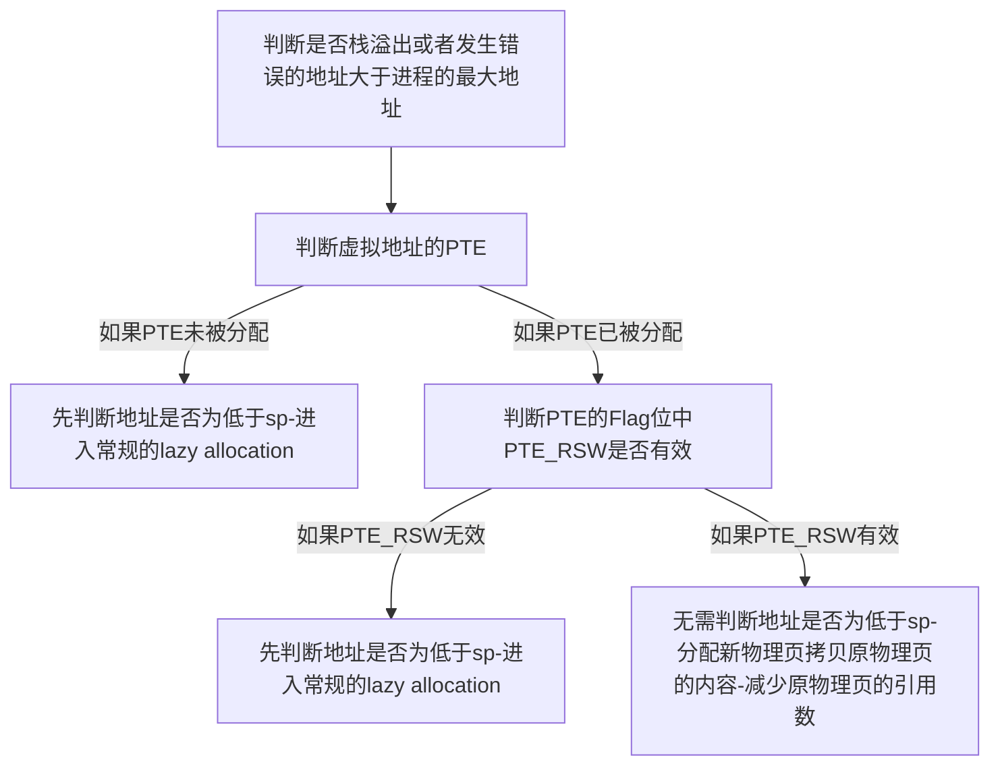

# Lab6

*本实验基于Lab5*

*  cow的整体思路如下

 ```mermaid
 graph TD;
 A[修改uvmcopy,让子进程的虚拟内存映射到父进程的物理内存,让两者的PTE的都不可写]--利用PTE的RSW位让发生页面错误时可以知道是由COW引起的-->B[父子进程如果尝试写内存发生页错误,修改usertrap,给该进程的错误页分配物理页,修改该页的PTE]
 
 ```

* **还需要解决物理页的引用问题**。由于现在一个物理页可能对应着多个虚拟页，所以不能随便释放，比如假如父进程结束，而子进程依然在运行，对应其物理页则不能释放物理页。现在需要给物理页添加一个引用数，同时修改内核的内存分配机制，每对该物理页建立一个映射就修改引用数，反之亦然，只有引用数为0，才释放该物理页。

现在给Xv6实现这个功能

## 对`kalloc.c`的修改

为了方便建立物理页到物理页引用数的映射，在`memlayout.h`添加宏

```c
#define COUNT(x) ((x-KERNBASE)/PGSIZE) 
```

物理页的管理是第一个需要修改的，

* 我们给结构体添加保存着每一块物理页被引用数量的数组

```c
struct {
  struct spinlock lock;
  struct run *freelist;
  char refercount[(PHYSTOP-KERNBASE)/PGSIZE];
} kmem;
```

* 修改物理页初始化函数,之所以要初始化为1，所以后面会`freerange`遍历一遍，这会free每一个物理页。

```c
void
kinit()
{
  initlock(&kmem.lock, "kmem");
  memset((void*)(kmem.refercount),1,(PHYSTOP-KERNBASE)/PGSIZE);
  freerange(end, (void*)PHYSTOP);
}
```

* 修改`kalloc`,分配物理页的同时，引用数加1。

```c
void *
kalloc(void)
{
  struct run *r;

  acquire(&kmem.lock);
  r = kmem.freelist;
  if(r){
    kmem.freelist = r->next;
    kmem.refercount[COUNT((uint64)r)]=1;
  }
  release(&kmem.lock);

```

* 修改 `kfree`,在释放该物理页前，先判断该物理页的引用数是否大于1。
  * 如果引用数大于1，则说明还有进程的内存指向该物理页，那么我们给引用数减1，并结束函数。
  * 否则，则清零引用数，和之前的`kfree.c`一样继续。

```c
  acquire(&kmem.lock);
  
  if (kmem.refercount[COUNT((uint64)pa)]>1){
    kmem.refercount[COUNT((uint64)pa)]--;
    release(&kmem.lock);
    return;
  }
  kmem.refercount[COUNT((uint64)pa)]=0;
 
  release(&kmem.lock);

  // Fill with junk to catch dangling refs.
  memset(pa, 1, PGSIZE);
```

* 既然存在不分配物理页但只增加物理页引用数的情况，我们就需要添加函数`kcount`

```c
void * kcount(void *pa){
  acquire(&kmem.lock);
  kmem.refercount[COUNT((uint64)pa)]++;
  release(&kmem.lock);
  return pa;
}
```


## 修改`uvmcopy`

```c
int
uvmcopy(pagetable_t old, pagetable_t new, uint64 sz)
{
  pte_t *pte;
  uint64 pa, i;
  uint flags;
  char *mem;

  for(i = 0; i < sz; i += PGSIZE){
    if((pte = walk(old, i, 1)) == 0)
      panic("uvmcopy: pte should exist");
      //continue;
    if((*pte & PTE_V) == 0)   continue;

      //panic("uvmcopy: page not present");
    pa = PTE2PA(*pte);
    flags = (PTE_FLAGS(*pte) & (~PTE_W)) | PTE_RSW;
    *pte=((*pte)&(~PTE_W)) | PTE_RSW;
    /*
    if((mem = kalloc()) == 0)
      goto err;
    */
    //memmove(mem, (char*)pa, PGSIZE);
    mem=(char *)kcount((void*)pa);
    //printf("copy va %p to  pa %p\n",i,pa);
    if(mappages(new, i, PGSIZE, (uint64)mem, flags) != 0){
      kfree((void *)mem);
      goto err;
    }
  }
  return 0;

 err:
  uvmunmap(new, 0, i / PGSIZE, 1);
  return -1;
}
```

* 注释掉分配内存已经复制父进程内存到子进程内存的部分。
* 转而修改父子进程的PTE，使父子进程现在对物理页只能读，同时enable PTE_RSW位。
* 通过`kcount`函数增加物理页的引用数。

## 增加PTE_RSW

在 `riscv.h`中，添加宏

```c
#define PTE_RSW (1L << 8)
```


## 修改`trap.c`

```c
 }else if (r_scause()==13 || r_scause()==15 || r_scause()==12){//load/store page fault
    uint64 va=PGROUNDDOWN(r_stval());
    if (!walkaddr(p->pagetable,p->trapframe->sp)){
      p->killed=1;
      printf("stack overflow\n");
      exit(-1);
    }  
    if (va>=p->sz ){
        printf("how end3");
				p->killed=1;
     		exit(-1);
    }
    pte_t * pte=walk(p->pagetable,va,0);
    if (pte==0){
      if (r_stval()<p->trapframe->sp ){
                printf("how end4");
        p->killed=1;
        exit(-1);
      }
      void* padd=kalloc();
      if (padd==0){
        printf("how end1");
        p->killed=1;
        exit(-1);
      }
      //printf("here is lazy allocation\n");  
      if (mappages(p->pagetable,va,PGSIZE,(uint64)padd,PTE_U|PTE_W|PTE_R)!=0){
                printf("how end2");

        kfree(padd);
        p->killed=1;
        exit(-1);
      }
    }else{
        uint64 flags=PTE_FLAGS(*pte);
        if (flags & PTE_RSW) {
          if (flags & PTE_V) {
            flags=(flags&(~PTE_RSW)) | PTE_W;
          }else{
            printf("how end5");
            p->killed=1;
            exit(-1);
          }
        
        //flags=(flags&(~PTE_RSW)) | PTE_R;
          if (kkcount((void *)PTE2PA(*pte))>1){
            void* padd=kalloc();
            if (padd==0){
                      printf("how end6 %d\n",p->pid);
              proc_freepagetable(p->pagetable, p->sz);
              p->killed=1;
              exit(-1);
            }
            memmove(padd, (char*)(PTE2PA(*pte)), PGSIZE);
            kfree((void *)PTE2PA(*pte));
            *pte=0;
          //printf("Yes!\n");
            if (mappages(p->pagetable,va,PGSIZE,(uint64)padd,flags)!=0){
            //printf("No~\n");
                    printf("how end7");

              kfree(padd);
              p->killed=1;
              exit(-1);
            }
          }else{
            *pte=((*pte)&(~PTE_RSW)) | PTE_W;
          }

         // printf("cow %p pid=%d \n",va,p->pid);
      }else{ 
        if (r_stval()<p->trapframe->sp ){
                  printf("how end8");

          p->killed=1;
          exit(-1);
        }
        void* padd=kalloc();
        if (padd==0){
          p->killed=1;
          exit(-1);
        }
          
        if (mappages(p->pagetable,va,PGSIZE,(uint64)padd,PTE_U|PTE_W|PTE_R)!=0){
                  printf("how end10");

          kfree(padd);
          p->killed=1;
          exit(-1);
        }
        }
    }  
  
  }
```

由需要考虑lazy allocation，所以这里处理的逻辑复杂点，思路如下



## 修改`copyout`

* 修改`copyout`在将文件读进进程内存时格外地重要。因为之前COW新物理页的分配都经过page fault handler。可是如果内核直接给用户进程内存写内容，则没有相关分配的机制。所以需要使用修改`copyout`来增加分配物理页的机制。

```c
int
copyout(pagetable_t pagetable, uint64 dstva, char *src, uint64 len)
{
  uint64 n, va0, pa0;

  while(len > 0){
    va0 = PGROUNDDOWN(dstva);

    pde_t * pte=walk(pagetable,va0,0);

    if(pte==0) {
      if (va0>=myproc()->sz) return -1;
      void* padd=kalloc();
      if (padd==0){
        return -1;
      }
      if (mappages(pagetable,va0,PGSIZE,(uint64)padd,PTE_U|PTE_W|PTE_R)!=0){
        kfree(padd);
        return -1;
      }
    }else{
      uint64 flags=PTE_FLAGS(*pte);
      if(flags & PTE_RSW){
        //printf("hello again!\n");
        if (flags & PTE_V) {
          flags=(flags&(~PTE_RSW)) | PTE_W;
        }else{
          return -1;
        }
        void* padd=kalloc();
        if (padd==0){
          return -1;
        }
        memmove(padd, (char*)(PTE2PA(*pte)), PGSIZE);
        kfree((void *)PTE2PA(*pte));
        *pte=0;
        if (mappages(pagetable,va0,PGSIZE,(uint64)padd,flags)!=0){
          kfree(padd);
          return -1;
        }
        //printf("%p end pid=%d\n",va0,myproc()->pid);

      }
    }
    //printf("%p end pid=%d\n",va0,myproc()->pid);
    pa0 = walkaddr(pagetable, va0);
    if(pa0 == 0)
      return -1;
    n = PGSIZE - (dstva - va0);
    if(n > len)
      n = len;
    memmove((void *)(pa0 + (dstva - va0)), src, n);

    len -= n;
    src += n;
    dstva = va0 + PGSIZE;
  }
```

* 如果传进的虚拟地址没有对应的PTE，则给它分配一个空的物理页
* 如果传进的虚拟地址有对应的PTE同时PTE_RSW有效，则分配一个和新的物理页，并拷贝原物理页的内容。

## 为了通过测试的修改

在`sys_sbrk`的修改

```c
  if(n>(PHYSTOP-KERNBASE)){
    return -1;
  }
```

这对于懒分配来说，这应该不必要的。但这是对`usertests` 中`sbrk`相关的测试的妥协

来看这样一种情况


父进程fork出子进程，现在子进程sbrk到超过物理内存大小，再不断访问直到分配完所有的物理页，这时候父进程调用

```c
wait(&xstatus);
```

`wait`函数会回收子进程的内存，然而父进程因为无法分配出新物理页`wait`函数是无法调用出来，所以就进入了死锁。


## 结果

* 

* 
