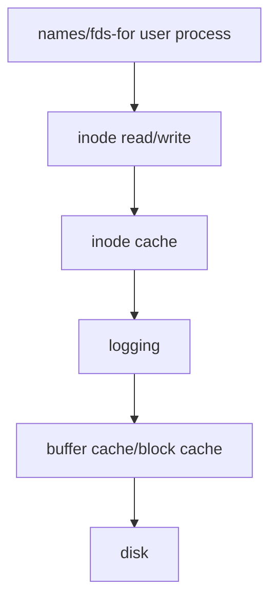

# File System

[TOC]

现在来介绍文件系统，这将使用三讲的时间，这讲和下一讲将使用Xv6,第三讲将基于Linux。我们一直在使用文件系统，文件系统有如下的特性

* **User-friendly names/pathname**:文件系统提供了对于用户友好的文件名，也就是**层级**的路径文件名。这可以帮助用户组织目录中的文件。
* **Share files between users/processes **:通过将文件命名为易记的名字，可以便于用户之间和进程之间更简单地共享文件。
* **Persistence/durability** :我们已经看过了Xv6的诸多子系统---内存，进程等等，文件系统和他们最大的不一样便在于提供持久化。文件系统的持久化一个例子就是如果现在关闭了计算机，过几天文件依然在计算机的相同位置(disk中)，这和一旦计算机重启则会消失的进程等其他资源(在内存中)完全不同。

**我们现在要学习文件系统内部的机制**

## 文件系统的有趣机制

文件系统和OS其他子系统首先的不一样在于：它所在的硬件是速度通常远慢于内存的磁盘(disk)。文件系统内部还有一些比较有趣的机制：

* **Abstraction is useful**：还记得在Lecture2的时候，我们曾说过文件是对硬件(disk)的抽象，文件系统是如何做到这一点的？
* **Crash safety** : 这和持久化有关，即如果使用文件系统的时候，计算机突然崩溃了。那么需要保证
  
  1. 重启以后计算机的文件系统依然保持完好。
  2. 磁盘上的文件数据依然存在，且用户可以使用大部分文件。
* **Disk layout** ：和memory layout类似，在文件系统需要在**磁盘中**(重启的时候，数据能全部恢复)通过维护一些数据结构来表示文件或者目录的结构和内容，在Xv6中，这些数据结构比较简单，真实的文件系统则会更复杂。

* **Performance** : disk的速度很慢，例如向SSD disk写数据通常是一个毫秒(ms)级别的操作。在1ms里,CPU和内存之间可以做很多工作，所以考虑到性能

  1. 一方面我们要避免进行读写disk(即I/O操作)，所以提供了**buffer cache**。
  2. 另一方面我们可以让CPU的运行和I/O操作==并行==进行，所以需要进程间的==并发==（**concurrency**）支持。

  *这里说并行是指I/O操作和进程之间，而并发是指进程之间*

  比如，一个进程需要去做路径名的查找，它需要和disk交互，那么它交互过程中等待I/O结束时，另一个进程便可以在CPU上运行。

## 文件系统实现

### 通过API初窥文件系统

我们先来看文件系统的API

1. ```c
   fd=open("x/y",FLAG);
   ```

   `open`系统调用将会在目录x创建文件y，并返回文件描述符。

2. ```c
   write(fd,"abc",3);
   ```

   `write`系统调用将通过文件描述符向文件写入"abc" 这三个字符。

3. ```c
   link("x/y","x/z");
   ```

   `link`系统调用可以用来给刚才创建的"x/y"文件创建另一个名字

4. ```c
   unlink("x/y")
   write(fd,"def",3);
   ```

   `unlink`系统调用可以用来删除特定的文件名

   

现在我们透过这些接口可以窥见文件系统实现的一些细节。

* `open`接口使用的路径名是由用户选择的字符串，而不是一串数字。

* `write`接口并没有使用offset的参数，这意味着==文件系统一定维护了文件的offset==。下一次写文件的时候会从第4个数据开始写。

* `link`接口的出现说明文件系统的内部需要维护某种机制(==指针？==)使得多个文件名指向同一个文件。

*  `unlink`接口使用删除文件名，只要文件描述符还存在，则依然可以通过文件描述符写文件，**这就说明在文件系统内部，文件描述符必然和某个对象关联**，而且该对象不依赖文件名。

  

  ==**典型的文件系统实现了上述的API，但我们需要意识到文件系统只是存储系统的一种，比如数据库就通过不同的方式存储数据，它提供的API 完全不同。**==

### 文件系统的结构

Xv6文件系统最核心的数据结构是

* **inode**

  1. `inode`代表一个文件的对象，存放文件的信息, 不依赖文件名

  2. 在文件系统里引用一个`inode`不是通过文件名，而是通过`inode`的编号

  3. ```mermaid
     graph LR;
     inode-->A[link count]
     inode-->B[openfd count]
     ```

     `inode`维护两个数据

     1. `link count`，这个数据是所有指向该`inode`的文件名数量。
     2. `openfd count `，这个数据是当前打开了文件的文件描述符计数。

     只有这两个数据都为0的时候，文件才会被删除。

* **file descriptor**

  `fd`是文件在进程中的抽象，另外很重要的一点就是之前提到的，`fd`必然维护着一个对文件读写的offset。

#### 文件系统层次



文件系统较为复杂，所以可以按照分层的方式来理解

* **disk** ：磁盘是文件系统的底层，是实际保存数据的地方，disk的特性提供了**持久化存储**。

*下面的层次都在内存里*

* **buffer cache** ,或者叫**block cache** ：这是内存中对磁盘数据的缓存，避免了对磁盘的频繁读写。
* **logging**  : logging层是为了保证持久性，下一讲具体讲解。
* **inode cache** : inode的大小通常小于一个disk block,所以多个inode会放在一个disk block里，为了给单个inode提供同步（**synchronization**）操作，Xv6维护了inode cache。
* **inode** : 实现了`write`/`read`
* **file name/fd** : 文件名，和文件描述符都是用户进程中。

*disk block类似于memory page，是不同存储层次组织和分配数据的最小单位*

## 文件系统使用disk

### 存储设备

磁盘（disk）是一个传统的叫法，它也就是存储设备(storage device),之后会混用这两个词，我们熟悉的有

* **SSD** :0.1~1ms的时间读写一个disk block
* **HDD**: 10ms的时间读写一个disk block

磁盘还有两个描述大小的术语：

* **sector** :这是由硬件特性决定的，指磁盘驱动的可以读写的最小单元，过去通常是512字节。(在内存中，程序可读写的最小单位为字节)
* **block** : 这是由文件系统定义的数据块，是实际的OS会读写磁盘的最小单元。在Xv6中，它的大小是1024字节，也就是2个sector。


我们现在来看硬件的结构，总线连接上存储设备，同时连接内存和cpu。所以一个文件系统在cpu运行，代码和一些数据存储在内存，最后会以读写block的形式储存在SSD或者HDD。另外，和磁盘交互的程序被称为磁盘驱动。

*  读写block的接口很简单，主要就是由磁盘驱动提供`write/read`:我们可以提供block的编号给接口，磁盘驱动会通过写存储设备的控制寄存器，然后存储设备自己会完成工作。

  *磁盘驱动和console驱动的代码结构是类似的，都有bottom和top的部分，同时提供中断和读写控制寄存器的代码*

* 尽管不同的存储设备内部有不一样的属性，但从文件系统的视角来看，磁盘驱动基本可以用相同的方式来编程。

* 磁盘驱动会使用一些标准协议如**PCIE**和磁盘交互。

### Disk Layout


磁盘从文件系统的角度看就是以 block为单位的数组，Xv6采用磁盘布局如图

* **boot sector** : Block0 通常可以存放boot sector的代码来启动操作系统（并不意味着存放全部的OS），这些代码会之后再从文件系统加载更多OS的内容

  *在qemu上boot运行Xv6时，并没有使用这种方式，而是将内核的镜像内容直接加载到物理内存的0x80000000处,并没有从虚拟磁盘读boot sector的内容*

* **super block** : Block1 通常被称为super block,描述了文件系统：比如文件系统由多少block构成。我们可以通过 super block来构造大部分的文件系统信息。

* **log** : log存储在从Block2到Block32（不包含 Block32）这30个block

* **inodes** ：inode存储在Block32到Block45(不包含Block45),每个inode是64字节，多个inode会打包成一个block。

* **bitmap block** : 处于Block45，只占据了一个block,记录了数据block是否空闲

*以上的46个block也被叫做meta block*

* **data block** ：数据block是从Block46开始，存储了文件和目录的内容。

我们还可以通过inode的编号来计算inode处于哪个block

$block=32+(inode*64)/1024$

需要指出，文件系统可以在重新启动后通过这些磁盘上的数据结构重新构建，这就达到了持久性的目的。

## inode

现在来介绍inode,如下是Xv6中inode的结构体（这是磁盘上inode的数据结构,和内存的不同，因此命名为dinode）

```c
struct dinode {
  short type;           // File type
  short major;          // Major device number (T_DEVICE only)
  short minor;          // Minor device number (T_DEVICE only)
  short nlink;          // Number of links to inode in file system
  uint size;            // Size of file (bytes)
  uint addrs[NDIRECT+1];   // Data block addresses
};
```

这是一个64字节的数据结构，核心字段如下

* `type` :  inode的类型，表示inode为文件还是目录
* `nlink` : link 计数器，用来跟踪多少文件名指向该inode
* `size` : 字节为单位的文件数据大小
* `addrs` :这是一个13位的数组，放入0~12 block number
  1. block number 0~block number 11都是direct block number,每个block number都直接对应着磁盘里的一个包含文件数据的block
  2. block number12是indirect block number,这个block number对应着一个block,这个block包含了256 direct block number。


基于以上的内容，我们可以知道文件最大可以储存$(256+12)*1024$字节=268KB的数据，这是一个很小的长度。所以我们需要提供一种机制来拓展文件系统支持文件的大小，方法就是**构建double indirect block number**。

* 如图就是一个示例，现在indirect  block number 指向的block包含的不是256个direct block number而是256个indirect block number，每个indirect block number再指向包含256个direct block number的block。包含了每个inode支持的最大文件长度变成了$256*256*1KB=64MB$.


* 每个block有1024字节,现在一个block number为4个字节，因此每个block可以包含256个block number。block number 4字节的限制意味磁盘最大为$2^{32}B$即$4TB$，然而现在磁盘的大小可能大于这个数字，所以就需要采取更大的block number 。

这样的结构类似多级的page table，本质是一个树状的结构。进一步的，我们可以使用B树来组织block。

### 思考why inode?

*现在来思考==为什么需要inode来组织文件的block==？*

首先磁盘的block和物理内存的page是类似的，每个进程都需要一个页表，这是因为每个进程虽然虚拟地址空间很大，但实际并不需要那么多的物理page, 所以我们通过页表来建立虚拟页到已分配到该进程物理页的映射。

1. 现在如果把文件和进程做类比，那么文件的inode就可以类比为进程的页表。

2. 事实上，我们现在就可以推定并不是每一个block number处都会分配block number,比如现在文件的数据只有2个字节，我们只需要给inode分配一个block。并且在文件系统中，必然会需要提供一个接口类似内存管理的`kalloc`来分配block。

3. 有了页表，进程就知道需要到物理内存哪里取数据，类似的，有了inode，我们就知道要读取比如文件的第8000个字节需要去哪个读取。

   流程是这样的

   ```mermaid
   graph TD;
   通过8000/1024计算出inode.addrs数组的位置-->A[得到数据位于的block number]-->B[通过8000%1024计算出字节在block里的offset]
   ```

4. 基于以上，我们可以知道通过inode的信息就足够我们实现对文件的`read/write`。

### 目录（directory）

目录和文件都使用inode，Xv6使用`type`字段来区分目录和文件。目录和文件不同在于，它对应的block存储不是文件的数据，而是directory entries,每个entry对应着一个文件或者目录，格式如下


* 前2个字节是文件或目录对应的inode编号inum
* 后14字节是文件或者目录的名称

怎么样通过这些entry来实现路径名查找呢？（以查找路径名"/y/x"为例）

1. 首先我们知道这是从根目录出发查找，则先需要先查找root inode（root inode的inum往往是固定的，在Xv6中，这个编号是1,从之前的disk layout可知，inode1位于block32的64到128字节）
2. 现在我们通过读取root inode的所有indirect block number和direct block number来扫描目录的所有block。
3. 扫描目录block中所有的directory entry，查看是否有目录名为"y"。如果有，则目录"y" 也有对应的inum,假设这个inum为251，则接下来去找inode251，再去扫描其block寻找下一级的目录或者文件。

这种层次化的路径名是文件系统可以理解的，所以对于用户来说，便可以在某级目录下保存用户友好的文件名。

#### 在Xv6中利用B树优化路径名查找

## File system工作示例

现在看文件系统的工作


* 启动Xv6的最后将使用`mkfs`,它将参数里包含的所有文件传进`fs.img`这个文件镜像中.
* `mkfs`创建的这个文件系统中，一个包含了1000个block,其中46个meta block，具体如上图所示。在file system lab中，我们将会支持更大的文件系统。

现在稍微修改Xv6的代码，使得对文件和某块block进行操作时，可以打印出来，在Xv6运行

```shell
echo "hi" > x 
```


出现以上的结果

1. 首先是创建文件x
   1. **write 33**：说明文件系统会为文件x创建一个inode。
   2. **第一次write 33**：会修改 inode的`type`字段从空闲到文件，这表示该inode已经被使用了。
   3. **第二次write 33**：会给inode写入内容，比如linkcount等等。
   4. **write 46**：block 46是第一个data block,也是根目录的data block。文件x是根目录下的文件，此时是在根目录的data block里写入表示文件x信息的directory entry。
   5. **write 32**：是因为根目录的大小已经发生变化，所以修改根目录的inode的`size`字段
   6. **最后write 33**：


2. 将"hi"写进文件里
   1. **write 45**：这里会更新bitmap: 文件系统会扫描bitmap block,找到还没使用的block对应的bit位（为0），并设置为1。(这表明将该data block分配给文件x) 
   2. **write 595**: 文件系统在上一步分配了block 595给文件x，所以文件x的inode第一个direct  block number是595。现在要向block 595写入两个字符，因此调用了两次。
   3. **write 33**: 修改文件x 的inode的`size`字段。（这里inode因为第一次被添加了data block，所以还需要更新direct block number）
3. 将"\n"换行符写进文件
   1. **write 595**: 现在要向block 595写入一个字符。
   2. **write 33**: 修改文件x 的inode的`size`字段。

## Xv6创建inode

现在我们看看创建一个文件的时候代码做什么：(以`open("/x",O_CREATE)`为例)

首先是系统调用的`open`函数

```c
uint64
sys_open(void)
{
  char path[MAXPATH];
  int fd, omode;
  struct file *f;
  struct inode *ip;
  int n;

  if((n = argstr(0, path, MAXPATH)) < 0 || argint(1, &omode) < 0)
    return -1;

  begin_op();

  if(omode & O_CREATE){
    ip = create(path, T_FILE, 0, 0);
    if(ip == 0){
      end_op();
      return -1;
    }
  }
	//
  ...
  //
}
```

* `omode`是`open`文件的标志位，当我们需要创建文件的时候，会使用`create`函数以绝对路径`path`为参数为该文件创建`inode`

`create`函数

```c
static struct inode*
create(char *path, short type, short major, short minor)
{
  struct inode *ip, *dp;
  char name[DIRSIZ];

  if((dp = nameiparent(path, name)) == 0)
    return 0;

  ilock(dp);

  if((ip = dirlookup(dp, name, 0)) != 0){
    iunlockput(dp);
    ilock(ip);
    if(type == T_FILE && (ip->type == T_FILE || ip->type == T_DEVICE))
      return ip;
    iunlockput(ip);
    return 0;
  }

  if((ip = ialloc(dp->dev, type)) == 0)
    panic("create: ialloc");

  ilock(ip);
  ip->major = major;
  ip->minor = minor;
  ip->nlink = 1;
  iupdate(ip);

  if(type == T_DIR){  // Create . and .. entries.
    dp->nlink++;  // for ".."
    iupdate(dp);
    // No ip->nlink++ for ".": avoid cyclic ref count.
    if(dirlink(ip, ".", ip->inum) < 0 || dirlink(ip, "..", dp->inum) < 0)
      panic("create dots");
  }

  if(dirlink(dp, name, ip->inum) < 0)
    panic("create: dirlink");

  iunlockput(dp);

  return ip;
}
```

* 在`create`函数中，我们首先会使用`nameiparent`得到该路径文件所在目录inode `dp`，在例子中就是x所在根目录的inode,同时从路径("/x")解析处文件名`name`"x"。
* 然后使用`dirlookup(dp, name, 0))i `遍历目录的dir entry查看文件x是否存在。
* 如果文件不存在，则使用`ialloc `给文件x分配一个inode.

```c
struct inode*
ialloc(uint dev, short type)
{
  int inum;
  struct buf *bp;
  struct dinode *dip;

  for(inum = 1; inum < sb.ninodes; inum++){
    bp = bread(dev, IBLOCK(inum, sb));
    dip = (struct dinode*)bp->data + inum%IPB;
    if(dip->type == 0){  // a free inode
      memset(dip, 0, sizeof(*dip));
      dip->type = type;
      log_write(bp);   // mark it allocated on the disk
      brelse(bp);
      return iget(dev, inum);
    }
    brelse(bp);
  }
  panic("ialloc: no inodes");
}
```

* 给文件分配一个inode的核心思路很简单，那就是遍历所有inode，如果这是一个空闲的inode,那就将其`type`修改为文件，返回该inode就好。


* 但是由于之前所强调的文件系统的层次，这一过程复杂一点，是这样

  1. 想要遍历inode的时候，用`bread`函数获取每个inode所在block在内存的block cache

     ```c
     struct buf*
     bread(uint dev, uint blockno)
     {
       struct buf *b;
     
       b = bget(dev, blockno);
       if(!b->valid) {
         virtio_disk_rw(b, 0);
         b->valid = 1;
       }
       return b;
     }
     ```

     其中使用了`bget`函数，参数是设备号和 block号

     ```c
     static struct buf*
     bget(uint dev, uint blockno)
     {
       struct buf *b;
     
       acquire(&bcache.lock);
     
       // Is the block already cached?
       for(b = bcache.head.next; b != &bcache.head; b = b->next){
         if(b->dev == dev && b->blockno == blockno){
           b->refcnt++;
           release(&bcache.lock);
           acquiresleep(&b->lock);
           //acquire(&b->lock); what if we use spinlock
           return b;
         }
       }
     
       // Not cached.
       // Recycle the least recently used (LRU) unused buffer.
       for(b = bcache.head.prev; b != &bcache.head; b = b->prev){
         if(b->refcnt == 0) {
           b->dev = dev;
           b->blockno = blockno;
           b->valid = 0;
           b->refcnt = 1;
           release(&bcache.lock);
           acquiresleep(&b->lock);
           return b;
         }
       }
       panic("bget: no buffers");
     }
     ```

     

     1. 数据结构`bcache`维护了一个block cache的链表，首先需要做的就是**从头节点从头到尾**遍历所有的block cache，查看是否有满足参数的block。以上图为例比如block33就在 block cache中，那么就可以返回该block。

        *准确来说,返回的是block33在内存中缓存的地址*
  
     2. 如果没有，则说明需要查找的block在内存没有缓存，这时候会==从尾节点从尾到头地==遍历`bcache`，找到引用数为0的block，初始化它并返回。(这里是在做block cache的替换）。表示内存里block cache的数据结构是`buf`)
  
        ```c
        struct buf {
          int valid;   // has data been read from disk?
          int disk;    // does disk "own" buf?
          uint dev;
          uint blockno;
          struct sleeplock lock;
          uint refcnt;
          struct buf *prev; // LRU cache list
          struct buf *next;
          uchar data[BSIZE];
        };
        
        ```
  
        *需要注意的如下*
  
        * 此时还并没有**真正地**从disk里读block,只是分配了一块block cache
        * 之所以block cache 需要用链表组织起来，和要使用LRU算法作为cache替换策略有关。每次使用一块block cache之后的时候，需要它放在链表头部，这样需要cache替换的时候，就从链表尾向前遍历(即取`refcnt=0`且最不常使用的block cache)
  
     3. 返回到`bread`，对block写。
  
  2. 获取到inode所在的block,现在要做的就确定
  3. `brelse`释放对应block cache的sleep lock，还做了一件刚刚提到的事就是把无引用的block cache放到链表头部
  
  ```c
  void
  brelse(struct buf *b)
  {
    if(!holdingsleep(&b->lock))
      panic("brelse");
  
    releasesleep(&b->lock);
  
    acquire(&bcache.lock);
    b->refcnt--;
    if (b->refcnt == 0) {
      // no one is waiting for it.
      b->next->prev = b->prev;
      b->prev->next = b->next;
      b->next = bcache.head.next;
      b->prev = &bcache.head;
      bcache.head.next->prev = b;
      bcache.head.next = b;
    }
    
    release(&bcache.lock);
  }
  ```
  
  开始我在这里略有疑惑的是在`brelse`之前，引用数应该一直保持为1才对(其他进程无法获得sleeplock)。但实际上，在
  
  ```c
  releasesleep(&b->lock);
  //这里
  acquire(&bcache.lock);
  ```
  
  其他进程就可能增加了对block cache的引用。

## Sleeplock

1. `bcache`使用的是spinlock , **保证一个block在buffer cache出现一次**。

2. 每个block cache使用的是sleep lock

   ```c
   void
   acquiresleep(struct sleeplock *lk)
   {
     acquire(&lk->lk);
     while (lk->locked) {
       sleep(lk, &lk->lk);
     }
     lk->locked = 1;
     lk->pid = myproc()->pid;
     release(&lk->lk);
   }
   
   void
   releasesleep(struct sleeplock *lk)
   {
     acquire(&lk->lk);
     lk->locked = 0;
     lk->pid = 0;
     wakeup(lk);
     release(&lk->lk);
   }
   ```

   * 和spinlock很大的一点不一样在于获取它以后，是属于==某个进程的==，这是因为获取它以后的并不会和spinlock一样关中断。不关中断的话，获取sleep lock以后就可以进行I/O操作了（使用spinlock的话，单核无法处理I/O结束的中断）

     ```c
     // Long-term locks for processes
     struct sleeplock {
       uint locked;       // Is the lock held?
       struct spinlock lk; // spinlock protecting this sleep lock
       
       // For debugging:
       char *name;        // Name of lock.
       int pid;           // Process holding lock
     };
     
     ```

   * 另外一点就是如果进程A获取block 33 后，进程B也想获取block 33的话，在使用spinlock的情况下，它就只能在CPU上空转，而使用spinlock的话，它没获得锁就会`sleep`，直到进程A释放sleep lock。
