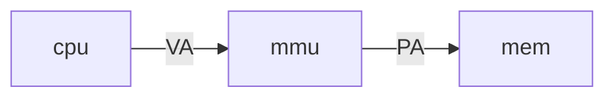

# page table

这一Lecture的主题将会是页表（page table）,它实现了从虚拟地址到物理地址的映射。


1. 首先将介绍地址空间（address space）。
2.  然后将描述实现虚拟内存的`RISC-V`硬件。
3. 最后将查看Xv6的虚拟内存代码，了解内核地址空间和用户地址空间的结构。

   

## Address space

内存由一些DRAM芯片组成，它会存储kernel或者用户程序的代码和数据。为了解决内存隔离性的问题，引入虚拟地址的概念。


要做的就是给每个程序专属的虚拟地址空间，所有程序的地址都是从0开始，不同程序间的地址彼此独立。那么如何在一个物理内存上创建多个虚拟内存地址空间？


## Page Table 

### 页表1

使用页表（page table)是一种最常见的解决方法。举一个例子，cpu正在执行一个命令`sd $7 (a0)`，这个指令表示把立即数7写进寄存器a7储存的地址对应的内存 。寄存器a7储存的地址并不是真正的物理内存地址，而是虚拟内存地址，在这个例子里假设这个虚拟地址为0x1000。cpu将虚拟内存地址传到内存管理单元mmu（Memory Management Unit），mmu将把它翻译成物理内存地址，最后用以索引内存。



### 页表2

mmu一旦打开，对于CPU来说，执行指令中的地址都是虚拟地址。mmu中需要一个table完成虚拟地址到物理地址的映射，这就是page table。通常来说，page table储存在内存中。在CPU中有一个叫做`SATP`的寄存器，它保存 page table的地址，这样，mmu就可以根据这个地址去内存中寻找table。（现在的讨论中MMU似乎并不会保存page table,只是去内存中找page table,而事实上mmu内部会有page table的缓存，就是TLB快表，之后讨论。）

值得注意的是，进程切换的时候SATP的寄存器会被内核（也只能被内核修改，执行在kernel mode中）修改，这一点我觉得很好地帮我们理解进程切换的含义，内核毫无疑问也保存了所有进程的page table在内存中的物理地址（准确来说，保留了一级页表的物理地址i）。


### 页表3

现在来思考上面的页表描述是否合理：假如每一个虚拟地址都对应着page table里的一个条目，存放虚拟地址是64位，这意味需要$2^{64}$个条目，而这些条目又储存内存里，所以光是这些条目本身就会耗尽内存。所以实际情况并不是这样，下面将从介绍`RISC-V`是如何工作的（注意以下都是硬件层面对页表的支持）：

要做的就是为每个page创建一个PTE(page table entry,页表条目)，而不是为每一个地址创建。一个page的大小为4KB，也就是4096 Bytes，它们是在内存中连续储存的字节。换而言之，一个page内4KB的地址共享一个条目。

在`RISC-V`中，虚拟地址目前只采用了39位，物理地址则采用了56位。虚拟地址根据page的大小分成了两个部分，第一部分是27位的index，它将用来在page table中索引44位PPN（physical page number),第二部分是12位的offset,它指在page中的偏移。44位的PPN加上12位offset就是翻译得到的56位物理地址。

*mmu索引PPN更详尽的解释：page table 储存在内存中，SATP储存了page table的**物理内存地址** ，mmu将SATP的地址加上index就得到了PTE的物理内存地址，取存以后得到的PTE的前44位就是PPN。*


需要指出的是，虚拟地址的前25位现在处于为使用的状态，这随着CPU支持虚拟内存的提升将有所减少，而物理地址的56位也是一个很大的数字，这是目前绝大多数内存达不到的。

### 页表4

页表3的设计依然不合理,注意到page table的PTE数量为$2^{27}$(index=27)，这依然是一个很大的数字。如果每一个进程都需要这样一个1GB的page table,那么物理内存很快就被消耗完了（我们的硬件模拟程序qemu一共才128M的内存）


而且事实上也没有必要，假如一个进程只需要一个page的物理内存，那page table的其他的条目都被浪费了。所以page table实际采取是一个多级的结构，27bit的index将被分成三个9bit的index（分别为L2，L1，L0），SATP寄存器储存的物理地址（一级页表）通过L2索引得到PPN指向二级页表，二级页表再通过L1索引得到PPN指向三级页表，最后三级页表通过L0索引得到PPN，这个PPN加上offset得到物理地址。此时页表中PTE的数量为$2^8$,即512个。每个PTE为64 bits, **这里设计的巧妙之处正在于,此时页表的大小也为4KB，和页的大小正相同**，这方便了内存的统一管理。

还有两点说明：

1. *通常page directory是指用来索引page table或者其他page directory物理地址的page table,不过在本lecture中它和page table意思差不多，所以中文统一用页表来表示*
2. *索引到下一级页表的PPN是44位，它将加上12位为0的bit才得到下一级页表的物理地址。*


需要注意的是最终得到的物理地址到内存中取的是一个字节8bit，而在到内存中取PTE取的却是64bit，所以虽然页表和页的大小相同，同为索引，offset是12bit，L2（L1,L0）index为9bit。


最后来看这样设计的合理之处：理论上来说，每一个进程的虚拟地址空间大小为$2^{39}$,需要$2^{27}$个PTE，但实际如果大部分地址没有被使用，那么压根没有必要准备那么多PTE。 我们假设一个进程的地址空间只使用一个page，那么事实上在页表3的设计中，只有第一个PTE是被使用的。而多级页表只需要三个（未使用的PTE不需要分配下一级页表）。经过计算，页表3的方案需要占用1GB，而只需要12KB，大大节省了页表对内存的占用。


### PTE中的标志位

在PTE中，后10位是标志位(flags )，它用来控制地址的权限，我们只关注前5个比较重要的。


1. V是Valid位，如果Valid bit为1，这表明这是一个合法的PTE，可以用来地址翻译。像在*我们假设一个进程的地址空间只使用一个page*的例子中，每级的页表只有第一个PTE的Valid bit为1，其他511个PTE的Valid bit 均为0；
2. R是Readable位，表示该进程是否可以读这个page。
3. W是Writable位，表示该进程是否可以写这个page。
4. X是Executable位，表明可以从这个page执行指令
5. U是User位，表明该page可以被运行在用户空间的进程访问。


---

## TLB

mmu查找虚拟内存对应的物理地址需要通过三层页表，这意味这多次访存，如果每次都这样做显得效率不高，所以mmu会有一个叫TLB（Translation Lookside Buffer）缓存一些PTE条目。举个例子，一个进程第一次需要访问一个虚拟地址时，mmu会通过三级页表得到PPN后访存，（图中VPN为virtual page number,其实也就是前面所说的虚拟地址里index），TLB会保存VPN和PPN的映射。之后该进程需要再访问该虚拟地址或者同page(VPN相同)的虚拟地址时，mmu直接使用TLB里的映射。这里利用了局部性原理，同一个page的地址很大概率会在接近的时间被访问。


需要注意的是,由于page table是隶属于某个进程的，所以当进程切换的时候，操作系统会告诉CPU让其清空TLB，这个指令是`sfence_vma`。

---

## Kernel Page Table

下面来看Xv6里page table是怎么样被使用的。

以下的图展示了kernel虚拟地址到物理地址的映射。右半张的结构完全是由硬件设计者决定的，DRAM（Dynamic Random Access Memory，也就是内存条）和I/O device进行了统一编址。


1. **从 0x00000000到0x80000000**（ 这个地址是KERNBASE）：

   这部分的物理地址被I/O device使用，这一部分虚拟地址到物理地址的映射是一一对应的（如图所示，直接就是虚拟地址和物理地址大小数值相等）。其中

   1. 地址0x00000000是被保留的。
   2. 地址0x10090000对应以太网。
   3. 地址0x1000是boot ROM的物理地址（这里的启动代码被写死在ROM），当主板被通电以后，会执行该处的代码，这里是引导加载程序，它会将Xv6加载到物理地址为0x80000000的内存中，操作系统从那来开始执行。

   4. 地址0x02000000是CLINT（Core Local Interruptor）,中断的一部分。

   5. 地址0x0C000000是PLIC（Platform-Level Interrupt Controller ），中断控制器会在中断的章节介绍。

   6. 地址0x10000000是UART0（Universal Asynchronous Receiver/Transmitter），它负责console和显示器的交互。

   7. 地址0x10001000是VIRTIO disk，这部分负责磁盘交互。

      *需要注意的是，低于0x80000000的物理地址被称为Memory-mapped I/O，这部分对于CPU来说和访DRAM一样，但实际是在和设备交互。当CPU有一个需要读写0x80000000的地址时，可以认为在RISC-V里有一个多路输出选择器（demultiplexer），它会把指令送到正确的I/O设备那里*,

      

2.  **从0x80000000(KERNBASE)到0x86400000(PHYSTOP)**

   这部分虚拟地址依然是和物理地址相同，这也是实际被使用的DRAM内存，需要注意的是此时物理地址和虚拟地址不再是一对一的映射，因为更大的虚拟地址同样会指向这块物理内存。

   这里的free memory将用来存放用户进程的page table,当一个进程被创建的时候，内核会为用户进程分配几个page的page table,填入PTE，之后某个时间点内核开始运行该进程，内核会将根page table的地址填入寄存器SATP中。

可以看到Xv6在0x00000000到0x86400000 page table的映射比较简单，虚拟地址和物理地址的大小是相同的。


大于PHYSTOP的虚拟地址情况有所不同：kernel stack处于虚拟地址的高处，它被从高地址到低地址地使用，在它的下面会设置一个叫Guard page的保护页。当kernel stack耗尽，溢出到Guard page时，因为Guard page的对应的PTE Vaild位会设置为0，所以触发page fault，这样就不会修改到其他内存的数据(体现了OS的Isolation),而且我们也知道kernel stack发生错误了。


这就体现了page table的灵活性，kernel stack在虚拟地址空间的kernel data和大于PHYSTOP的高处被映射到同一个物理地址两次，而实际使用时采取高处的虚拟地址，因为设置了Guard page。另一方面，page table压根就没有为Guard page的虚拟地址映射物理地址，这也节省了物理内存。所以page table的映射即可以是一对一，也可以是多对一的，一对多的，甚至不映射。


最后需要注意page的权限问题，比如kernel data标志设置为RW-，这意味着你可以读写它，但不能执行它，而kernel text设置为R-X，这意味它可以被读，不能被写，可以被执行。


* ==kernel page使用的page table在哪里==？

---

下面通过对kernel boot后的两个函数的讲解看看Xv6如何用代码实现


## kvminit()

## 补充一个函数

```c
void *memset(void *str, int c, size_t n)
```

现在进入`kvminit()`函数内部,来看看做了什么


1. 首先调用`kalloc`分配了一个page当最高级page directory，并初始化。

2. 然后调用`kvmmap`将不同的I/O设备映射到内核的地址空间

   *kvmmap第一个参数是虚拟地址起始地址，第二个参数是物理地址起始地址，第三个参数映射的空间大小，第四个是页表为这段内存设置的权限*

3. 将内核的text和data段以及trampoline段映射到内核的地址空间。

这些地址如UARTO的常量在`memlayout.h`中。

`vmprint`是我们要实现的函数，它将打印以下信息


1. 打印此时的 kernel page table的根目录地址。
2. L1 index : pte PTE pa PPN<<12 fl 标志位 0x1=0000000001 Valid
3. L2 index : pte PTE pa PPN<<12 fl 标志位 0x1=0000000001 Valid
4. L3 index : pte PTE pa PPN<<12 fl 标志位 0x1=0000000111  Write | Read | Valid


## kvminihart()


`kvminithart()`主要做两件事

1. 把内核页表的地址放进`STAP`寄存器中，使页表开始生效。在这条指令之前，还不存在可用的page table，所以也就不存在地址翻译。执行完这条指令之后，程序计数器（Program Counter）增加了4。而之后的下一条指令被执行时，程序计数器会被内存中的page table翻译，这是很重要的一步。

   **从这里开始，计算机的世界开始发生改变，不过需要注意这里可以继续执行指令的原因是虚拟地址和物理地址是相等的**

2. 刷新mmu里的TLB。

## walk函数

`walk`函数的功能是模拟硬件MMU得到虚拟地址对应的最低级的 `page table`的PTE,具体的实现如下图,最后返回指向PTE的指针。


```C
pte_T *pte=&pagetable[PX(level,va)];
```

这一行是从某级的页表中获取9个比特位查找下一级的PTE,看看代码是如何实现？

*pagetable是含512个PTE的数组*

```c
#define PGSHIFT 12  // bits of offset within a page
#define PXMASK          0x1FF // 9 bits
#define PXSHIFT(level)  (PGSHIFT+(9*(level)))
#define PX(level, va) ((((uint64) (va)) >> PXSHIFT(level)) & PXMASK)
```

两点需要注意

* `alloc `参数是用来决定如果某下一级页表不存在，那么是否要初始化一个新的页表作为下一级页表。
* 虽然`walk`使用的是物理地址进行模拟，但比较有趣的是，因为在设置了虚拟地址和物理地址相等的映射，所以即便在`satp`寄存器已经被设置内核进入虚拟地址空间了，这个函数依然可以使用。


