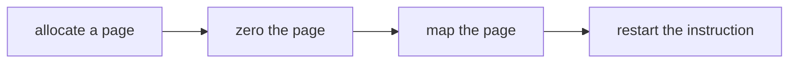

# Page Faults

fault听上去不是一个好词，然而page fault却是一个很精巧的机制。本讲将讲述基于它实现的几个功能：

* lazy allocation
* cow (copy-on-write fork)
* demand paging
* mmap(memory mapped  files)

在目前的Xv6这些一个都没有实现，之后的多个的实验需要完成这些功能。事实上，在目前的`usertrap.c` 可以看到,如果发生了page fault，那么进程直接被杀死了。

```c
 } else {
    printf("usertrap(): unexpected scause %p pid=%d\n", r_scause(), p->pid);
    printf("            sepc=%p stval=%p\n", r_sepc(), r_stval());
    p->killed = 1;
 }
```

虚拟内存有两个优点

1. **Isolation**
1. **level  of indirection**

隔离性(Isolation)已经在之前的Lecture中很好地被展示了，这层抽象(level  of indirection)却似乎有点无聊。因为在目前的映射关系基本都是静态的，甚至除了`trampoline page`和`trapframe page`以外，虚拟和物理地址之间都是直接映射，而通过page fault，我们将可以**动态地**更新page  table。

## page fault需要的信息

 page fault和syscall一样进入`trap`, 那么`trap`过程中内核需要哪些信息才能处理page fault呢？

* **出错的虚拟地址**，发生page fault时由硬件存放在`stval`寄存器中。

* **出错的原因**，发生page fault时由硬件存放在`sscause`寄存器中。看`RISCV`手册的表可以看到page fault有三种

  

  1. **Exception code:12** Instruction page fault（ 如：`jr a1`,a1的地址出错）
  2. **Exception code:13** Load page fault （如：`ld a1 (a2)` ,a2的地址出错）
  3. **Exception code:15** store page fault（如： `sd a1 (a2) `,a2的地址出错）

   还可以看到，我们通过`ecall`进入内核时`scause`对应8

* **出错指令的地址**，在lecture4中我们知道，硬件会把`pc`的值保存到`sepc`,而内核会保存`sepc`值到 `trapframe->epc`。因为处理完paga fault以后，我们将重新执行该指令，因此保存它是有必要的。


## Lazy page allocation

### eager page allocation


如果用户需要更多的内存，会使用系统调用`sbrk`

```c
uint64
sys_sbrk(void)
{
  int addr;
  int n;

  if(argint(0, &n) < 0)
    return -1;
  addr = myproc()->sz;
  if(growproc(n) < 0)
    return -1;
  return addr;
}
```

`sbrk`会增加用户进程的大小，扩大heap区，并分配物理内存建立与新heap区的映射，这就是eager page allocation。而用户程序往往并不知道自己需要多少内存，所以它会倾向于申请明显多于自己需要的内存，这就会导致一个问题，有一些物理内存可能进程一直用不到，这不是一个大问题，但可能会带来浪费。

###  modify `sbrk`

利用page fault可以采取一个更聪明的机制------lazy page allocation。对于`sbrk`修改代码如下

```c
uint64
sys_sbrk(void)
{
  int addr;
  int n;

  if(argint(0, &n) < 0)
    return -1;
  addr = myproc()->sz;
  myproc()->sz=myproc()->sz+n;
 // if(growproc(n) < 0)
 //  return -1;
  return addr;
}
```

现在，我们只增长进程的大小，却不给它建立新heap区和物理内存的映射，进程会以为自己已经增长了内存，因此可以访问`sz`到`sz+n`的地址，当它去访问的时候，就会触发page fault。*遇到问题，[这样解决](https://itcn.blog/p/30081334288.html)*

看看效果，boot以后键入`echo hi`,会得到一个page fault。这是因为`shell`会先fork出一个子进程，而子进程会通过`exec`执行`echo`。在这个过程中，`shell`会调用`sbrk`来申请一些内存，然后出错。观察输出信息，可以看到


* `scause`=0xf ,pid=3,这说明这是一个`store`page fault。且发生在pid=3的进程，这应该是`shell`
* `sepc`=0x12a8,这是发生page fault的指令地址
* `stval`=0x4008,这是触发page fault的虚拟内存地址

查看`shell`汇编中0x12a8，正是一个`store`指令。


沿着0x12a8向前看，会发现`malloc`函数。


这是非常合理的，因为`malloc`的实现正是通过`sbrk`。这说明前面调用了`sbrk`,然后这里想要储存寄存器的内容到并没有建立映射的heap中，然后发生错误。另一个佐证就是`shell`开始只有4个page，而无法访问的内存地址为0x4008，这是第5个page的地址。

## modify trap

现在Xv6的`trap`也需要修改了，它需要做一下这几件事：



修改`usertrap.c`,添加对page fault的处理：

```c
 } else if((which_dev = devintr()) != 0){
    // ok
  }else if(r_scause()==15){
    //page fault handler
    uint64 va=r_stval();
    printf("page fault %p\n",va);
    uint64 ka=(uint64)kalloc();
    if (ka==0){
      p->killed=1;
    }else{
      memset((void*)ka,0,PGSIZE);
      va=PGROUNDDOWN(va);
      if (mappages(p->pagetable,va,PGSIZE,ka,PTE_U | PTE_R | PTE_W)!=0){
        kfree((void*)ka);
        p->killed=1;
      }
    }
  }
```

现在应该可以work了吧，现在`echo hi`却出现以下信息


出现了新的page fault，这说明第一个page fault已经被处理了，


