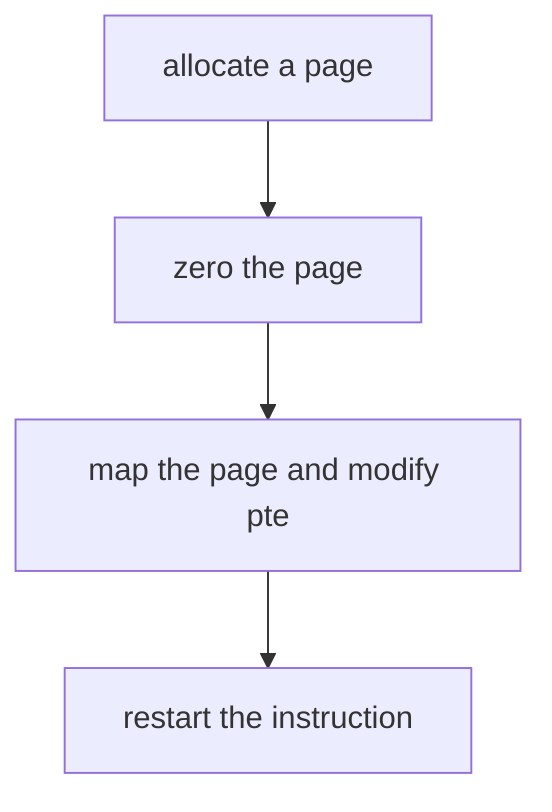
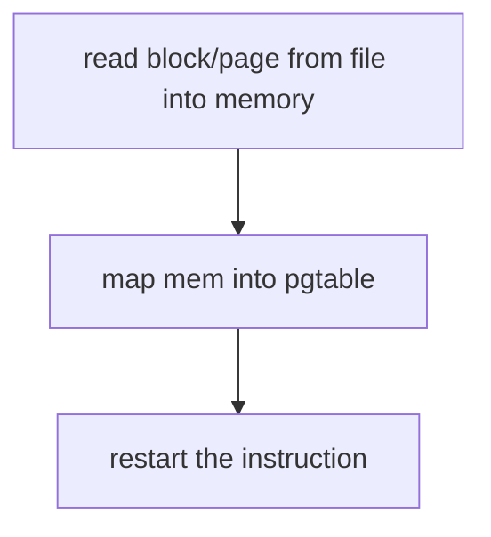

# Page Faults

fault听上去不是一个好词，然而page fault却是一个很精巧的机制。本讲将讲述基于它实现的几个功能：

* **lazy allocation**
* **zero fill on demand**
* **cow (copy-on-write fork)**
* **demand paging**
* **mmap(memory mapped  files)**

在目前的Xv6这些一个都没有实现，之后的多个的实验需要完成这些功能。事实上，在目前的`usertrap.c` 可以看到,如果发生了page fault，那么进程直接被杀死了。

```c
 } else {
    printf("usertrap(): unexpected scause %p pid=%d\n", r_scause(), p->pid);
    printf("            sepc=%p stval=%p\n", r_sepc(), r_stval());
    p->killed = 1;
 }
```

虚拟内存有两个优点

1. **Isolation**
1. **level  of indirection**

隔离性(Isolation)已经在之前的Lecture中很好地被展示了，这层抽象(level  of indirection)却似乎有点无聊。因为在目前的映射关系基本都是静态的，甚至除了`trampoline page`和`trapframe page`以外，虚拟和物理地址之间都是直接映射，而通过page fault，我们将可以**动态地**更新page  table。

## page fault需要的信息

 page fault和syscall一样进入`trap`, 那么`trap`过程中内核需要哪些信息才能处理page fault呢？

* **出错的虚拟地址**，发生page fault时由硬件存放在`stval`寄存器中。

* **出错的原因**，发生page fault时由硬件存放在`sscause`寄存器中。看`RISCV`手册的表可以看到page fault有三种

  

  1. **Exception code:12** Instruction page fault（ 如：`jr a1`,a1的地址出错）
  2. **Exception code:13** Load page fault （如：`ld a1 (a2)` ,a2的地址出错）
  3. **Exception code:15** store page fault（如： `sd a1 (a2) `,a2的地址出错）

   还可以看到，我们通过`ecall`进入内核时`scause`对应8

* **出错指令的地址**，在lecture4中我们知道，硬件会把`pc`的值保存到`sepc`,而内核会保存`sepc`值到 `trapframe->epc`。因为处理完paga fault以后，我们将重新执行该指令，因此保存它是有必要的。


## Lazy page allocation

### Eager page allocation


如果用户需要更多的内存，会使用系统调用`sbrk`

```c
uint64
sys_sbrk(void)
{
  int addr;
  int n;

  if(argint(0, &n) < 0)
    return -1;
  addr = myproc()->sz;
  if(growproc(n) < 0)
    return -1;
  return addr;
}
```

`sbrk`会增加用户进程的大小，扩大heap区，并分配物理内存建立与新heap区的映射，这就是eager page allocation。而用户程序往往并不知道自己需要多少内存，所以它会倾向于申请明显多于自己需要的内存，这就会导致一个问题，有一些物理内存可能进程一直用不到，这不是一个大问题，但可能会带来浪费。

###  modify `sbrk`

利用page fault可以采取一个更聪明的机制------lazy page allocation。对于`sbrk`修改代码如下

```c
uint64
sys_sbrk(void)
{
  int addr;
  int n;

  if(argint(0, &n) < 0)
    return -1;
  addr = myproc()->sz;
  myproc()->sz=myproc()->sz+n;
 // if(growproc(n) < 0)
 //  return -1;
  return addr;
}
```

现在，我们只增长进程的大小，却不给它建立新heap区和物理内存的映射，进程会以为自己已经增长了内存，因此可以访问`sz`到`sz+n`的地址，当它去访问的时候，就会触发page fault。*遇到问题，[这样解决](https://itcn.blog/p/30081334288.html)*

看看效果，boot以后键入`echo hi`,会得到一个page fault。这是因为`shell`会先fork出一个子进程，而子进程会通过`exec`执行`echo`。在这个过程中，`shell`会调用`sbrk`来申请一些内存，然后出错。观察输出信息，可以看到


* `scause`=0xf ,pid=3,这说明这是一个`store`page fault。且发生在pid=3的进程，这应该是`shell`
* `sepc`=0x12a8,这是发生page fault的指令地址
* `stval`=0x4008,这是触发page fault的虚拟内存地址

查看`shell`汇编中0x12a8，正是一个`store`指令。


沿着0x12a8向前看，会发现`malloc`函数。


这是非常合理的，因为`malloc`的实现正是通过`sbrk`。这说明前面调用了`sbrk`,然后这里想要储存寄存器的内容到并没有建立映射的heap中，然后发生错误。另一个佐证就是`shell`开始只有4个page，而无法访问的内存地址为0x4008，这是第5个page的地址。

### modify trap

现在Xv6的`trap`也需要修改了，它需要添加page fault handler做以下这几件事：



修改`usertrap.c`,添加对page fault的处理：

```c
 } else if((which_dev = devintr()) != 0){
    // ok
  }else if(r_scause()==15){
    //page fault handler
    uint64 va=r_stval();
    printf("page fault %p\n",va);
    uint64 ka=(uint64)kalloc();
    if (ka==0){
      p->killed=1;
    }else{
      memset((void*)ka,0,PGSIZE);
      va=PGROUNDDOWN(va);
      if (mappages(p->pagetable,va,PGSIZE,ka,PTE_U | PTE_R | PTE_W)!=0){
        kfree((void*)ka);
        p->killed=1;
      }
    }
  }
```

现在应该可以work了吧，现在`echo hi`却出现以下信息


出现了新的page fault，这说明第一个page fault已经被处理了。但`uvmunmap`在报错，这是为什么？其实很好理解，用户空间的部分地址最开始并没有建立映射也没有因为发生page fault建立映射，那么当然会发生not mapped。所以最后还需要修改`uvmunmap`函数,

### modify `uvmunmap`

修改

```c
    if((*pte & PTE_V) == 0)
      panic("uvmunmap: not mapped");
```

为

```c
    if((*pte & PTE_V) == 0)
      //panic("uvmunmap: not mapped");
      continue;    
```

 现在就ok了，我们将在`lazy lab`实现更多


## Zero Fill On Demand


用户进程的地址空间除了data区和text区以外，还有bss区，这里存放未初始化或者初始化为0的全局或者静态变量。编译之后，生成的数据存放在外存，当我们执行`exec`将数据加载到内存的时候，可以运用一些tricks,比如bss区既然全是0，而且里面也许有很多page，那么我们在内存只分配一个物理page,让bss区所有虚拟地址page都映射到该page上。


==但此时需要设置bss区对应的PTE设置为只读，而不能写==，这样写入该区内存的指令就会触发page fault,同lazy allocation一样，我们分配物理内存并建立映射并注意设置触发页的PTE可读可写，最后重新执行指令。

* 到目前为止，我们已经见识了基于page fault可以做些节省物理内存的工作，但这是**有代价的**，在`trap`的Lecture中我们已经见识了`trap`的需要相当大量的指令，这意味着时间的代价是不可忽略的。

## Copy On Write Fork

回顾运行`echo`的过程，`shell`会 fork一个和自己拥有完全一样地址空间的子进程，随后子进程调用`exec`,舍弃子进程的地址空间 ，取而代之的是包含了`echo`的地址空间。

观察原来`fork`的代码,它调用的`uvmcopy`函数做的是创建新的物理内存，并把父进程的内容一页一页地拷贝进去，并建立映射。

```c
 // Copy user memory from parent to child.
  if(uvmcopy(p->pagetable, np->pagetable, p->sz) < 0){
    freeproc(np);
    release(&np->lock);
    return -1;
  }

int
uvmcopy(pagetable_t old, pagetable_t new, uint64 sz)
{
  pte_t *pte;
  uint64 pa, i;
  uint flags;
  char *mem;

  for(i = 0; i < sz; i += PGSIZE){
    if((pte = walk(old, i, 0)) == 0)
      panic("uvmcopy: pte should exist");
    if((*pte & PTE_V) == 0)
      panic("uvmcopy: page not present");
    pa = PTE2PA(*pte);
    flags = PTE_FLAGS(*pte);
    if((mem = kalloc()) == 0)
      goto err;
    memmove(mem, (char*)pa, PGSIZE);
    if(mappages(new, i, PGSIZE, (uint64)mem, flags) != 0){
      kfree(mem);
      goto err;
    }
  }
  return 0;

 err:
  uvmunmap(new, 0, i / PGSIZE, 1);
  return -1;
}
```

 考虑到`exec`之后，子进程的地址空间将会被完全舍弃，这里逐页拷贝父进程内容的行为就显得有些浪费。所以我们可以优化的一件事就是用cow(copy on write) fork来替代fork。cow fork不会去创建新物理内存和拷贝，而是直接把子进程的虚拟内存映射到父进程的物理内存上。这时候对PTE的设置无疑需要比前一节更小心，因为我们不希望进程间会发生内存被对方写的情况。为了保证隔离性，我们设置父与子进程的PTE都只为**可读**。当我们想要向父或者子进程的内存写入时，就会触发page fault，没错，熟悉的感觉来了。


* 假设子进程使用`store`指令写入某页物理内存，page fault handler做以下的处理。现在子进程的pte已经修改为可读可写，再重新运行指令就可以了。

   ```mermaid
   graph TD
   A[allocate a page]-->B[copy the page]-->c[map the page and modify pte]-->D[restart the instruction]
   ```

* **注意，lazy allocation和zero fill on demand这两种机制由于新创建的内存全部填0，所以可以使用相同的page fault handler,但cow fork的page fault handler因为还需要拷贝原物理内存的内容，所以需要考虑新的page fault handler。事实上pte的bit9标志位可以用于识别出这是由于cow fork触发的page fault**。

  

* 最后需要注意一点，那就是之前的用户进程物理内存(除了`trampoline page`)只属于这个用户进程，所以结束进程的时候释放物理内存。但由于cow fork的存在，一块物理内存可能被多个用户进程共享，所以==需要对每一页物理内存维护一个引用计数==，当引用计数为0的时候，才能释放该页内存。

## Demand Paging

### Demanding Page (1)


回到这张图，当我们用`exec`加载bss段的时候只用了一个物理page，把data和text段完整加载进了内存。按照前几小节的经验，为什么不等到需要data和text段的时候再加载这些内存呢？事实上，一个程序二进制文件需要占有的内存也许是很大的，没有必要全部加载到内存里。仿照之前的做法，我们干脆`exec` 的时候不给data和text段建立映射，将pte的valid位设置为0。

==这里和之前设置pte为可读的情况不同==，*因为调用`exec`的时候，是新进程覆盖原进程，原进程的物理内存数据是被舍弃的，由于新进程的文件数据压根没有加载进内存，此时物理内存连读都不可以，所以设置pte的valid位为0*

`exec`终究是要执行新应用程序的，所以接下来会跳到应用程序的第一条指令也就是text段的地址为0处。这时候会触发page fault。page fault handler会做这几件事



与之前不同在于，这时候需要考虑文件系统。在这里并没有说明这样的问题

* 如何识别这是由于demanding page导致的 page fault？
*  既然不在`exec`的时候读文件，之后怎么读，需要保存文件描述符嘛？

### Demanding page(2)

现在考虑更实际的问题，如果内存已经被耗尽，而此时又发生了page fault,此时该怎么办呢？这不仅仅是demanding page的问题，而是所有的page fault handler都需要考虑的问题。策略很容易想到，那就是**evict page**。接下来关键便在于evict 哪个 page?

* 采取LRU(Least Recently Used)策略，即选择最近最少被使用的page。
  1. 每个pte有一个dirty位--即图中的bit7，用于标识该page是否被写过。
  2. 还有一个access位--即图中的bit6,用于标识该page是否被读或者被写过


* 具体采用哪个标识位作为LRU策略evict a page可以取决于OS怎么设计。
* 如果用access bit进行排名， 作为LRU策略的凭据，OS还会做的事情就是定时恢复access bit为0，比如每100ms恢复一次，这样才能保证access位的有效性。


## Mmap（Memory Mapped Files）

### 系统调用mmap

系统调用mmap是为了操纵文件，它的做法是把部分或者完整的文件加载到内存，然后使用`store`或者`load`来操纵文件数据。

### 参数

 `mmap(va,len,prot,flags,fd,offset)`

* `va`文件加载到内存的虚拟地址
* `len`加载数据的长度
* `prot`文件数据在内存中的权限，可读或者可写
* `flags` 标志位
* `fd`打开的文件描述符
* `offset`文件的偏移量

### unmap

结束对文件数据在内存的操作以后，会使用`unmap`的系统调用将文件内存dirty bit为1的页写回文件。

### Lazy实现

OS可以通过lazy的方法实现，`mmap`的时候并不立马把文件拷贝进内存，而是通过一个VMA的结构体记录还没有加载进文件数据的虚拟内存所对应的文件描述符和偏移量。page fault发生时，如果触发的虚拟内存在VMA记录的范围内，就加载文件的数据从磁盘到内存。同样的，之后使用`unmap`的系统调用将映射了文件数据的内存中dirty bit为1的页写回文件。


###
