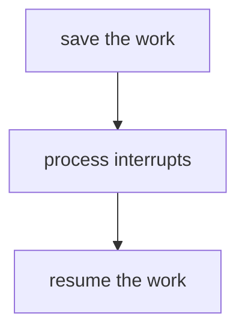
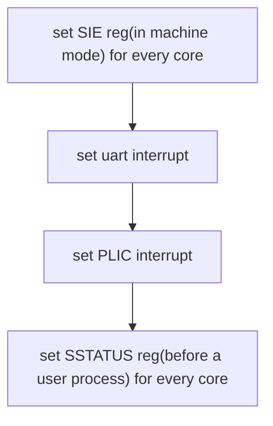

# Interrupts

[TOC]

OS对于中断(interrupts)和系统调用的处理有很多相似之处，当硬件触发中断的之后，OS会做以下的工作:



所以我们会使用相同的机制,即`trap`。但同时,中断又和系统调用有所不同，这正是这一讲的重点。

* **asynchronous**，所谓异步性，我认为认识这一点很重要。与系统调用不同，硬件发生中断的时机和当前运行的进程在CPU上的指令没有关系，而发生中断后，OS的Interrupt handler也和运行进程没有关系。回顾一下，不管是发生了page fault或者进行系统调用进入`trap`时，它们都会向内核传递参数，中断则完全没有。
* **concurrency**,并行性。CPU和产生中断的设备是真正的并行运行。
* **program device**,发生中断的外部设备如网卡，UART都是可编程的，事实上它们有自己的寄存器，有自己可执行的操作。

在此之外，本讲还会讨论：

1. console中的提示符`$`如何显示的
2. 键入`ls`时，这些字符是如何在console中显示

## Interrupts的硬件支持


讨论Interrupt的硬件之前，先来回顾这张图。物理地址0x80000000之下，是处理器连接的外设设备，我们关注UART0和PLIC：

* UART0这部分连接console，通过对该设备地址使用`load/store`来编程。

* 所有的外部设备都连接到处理器上，如图所示：

  处理器则是通过PLIC(Platform level  Interrupt  Control)来处理这些设备的中断的


### PLIC

再来看看PLIC的结构：

* 它一边连接不同的外部设备，有53个不同externel interrupt到达
* 另一边它连接着多个CPU的core


PLIC的具体工作流程是这样的：

1. 中断到达PLIC

2. PLIC会一一通知core，这里有一个待处理的中断 （**是否每一个core都会接收到中断呢？这取决于对PLIC的编程，在Xv6中，每个core都会接收到，但只有一个会claim自己接收了中断**）

3. * 如果某个core没有在处理其他中

     断，那么它就会向PLIC claim自己接收中断，PLIC就不会通知其他core来处理中断

   * 如果每个core都在处理其他中断，那么PLIC就会保留该中断直到某个core可以接收

4. 当core处理完中断后，它会通知PLIC,PLIC就不会再保留中断的信息

**在上述的描述，PLIC会需要一些内部数据来跟踪中断的状态**

## 设备驱动

 设备驱动(device driver)是内核的一个模块，专门用于管理设备。现在我们主要来看UART的驱动，在Xv6中，也就是`uart.c`文件中。驱动程序分为`bottom`和`top`两个部分

* `bottom`主要是Interrupt handler。如果CPU在PLIC通知后接收了中断，同系统调用一样进入`trap`,而之后就会调用Interrupt handler(对于UART来说就是函数`uartintr`）。

* `top`部分就是一些内核或者用户进程的接口。对于UART来说，这是`write/read`。

* `bottom`和`top`共享读写驱动中的数据buffer(队列)。

  

### 对设备编程

对设备的编程是基于Memory mapped I/O完成的，即将I/O和内存统一编址。当对这些地址执行`load/store`指令时，其实是操作这些I/O设备，比如对UART来说，就是读写UART的寄存器。


该图片展示的就是，SiFive主板上不同I/O设备的地址。可以看到PLIC和UART0的地址，不过这里的地址和qemu模拟不一定相同。

### UART的编程

然后讲解对UART的编程，[这是UART的文档](http://byterunner.com/16550.html)。


该图展示了UART不同寄存器的功能，每个寄存器只保存一个字节的数据。

* 地址为UART+000的寄存器,可以对它写，它会输出到别的地方。也可以读该寄存器
* 地址为UART+001的寄存器，控制UART是否产生中断，bit0到bit3分别控制不同的中断。
* 这里只是粗略介绍，具体看手册。

UART在qemu模拟的环境中，连接两个设备，一个是console,即显示设备，另一个是键盘。


## Xv6的中断设置

### `$`和`ls`

我们研究Xv6的中断是如何工作之前，回到ls和$是如何显示的这个问题上。

*  `$`是`shell`的输出。`shell`将字符`$`输到UART的寄存器`THR`上，UART0会将字符发送到另一个UART芯片上(为了区别，称它为UART1)。UART1会和模拟的console连接，进一步的，`$`会显示在console上。**中断发生在UART0将字符发送到UART1后**。我认为这里之所以需要发生中断，是需要告诉内核`THR`寄存器可以继续发送字符了

* `ls`则不同，键盘连接到UART1的输入端，当键盘键入字符时，UART1会发送字符到UART0,UART0会将bit数据合并成一个byte，之后再产生一个中断告诉CPU这里有一个待处理的字符。之后就是Interrupt handler上场的时候了


好，在这里标记一下，这只是对这个问题的初步解释，下面将通过对内核代码的解释具体看看Xv6里关于中断的设置，进而弄清楚这里的工作原理。

### RISC-V 中断相关的寄存器

* **SIE**(Supervisor Interrupt Enable ):该寄存器不同的bit对应着不同的中断
  1. bit E: 外部设备如UART的中断
  2. bit S: 软件中断(由CPU的一个core触发给另一个core)
  3. bit T:  计时器中断
  4. *某位bit设置为1后，意味着对应的中断开启，本讲专注于外部设备的中断 。*

* **SSTATUS**(Supervisor Status):这是一个supervisor mode寄存器，不同的bit表达不同的状态，我们关注其中控制中断的bit，该bit可以控制所有中断的开关。
* **SIP**(Supervisor Interrupt Pending),发生中断之后，我们可以在这里查看中断的原因。
* **SCAUSE**，发生`trap`的原因，中断是其中之一。
* **STVEC**,保存`trap`程序的起始PC。

### 中断的初始化

1. 来看`start.c`里面,和中断相关的是这段

```c
// delegate all interrupts and exceptions to supervisor mode.
w_medeleg(0xffff);
w_mideleg(0xffff);
w_sie(r_sie() | SIE_SEIE | SIE_STIE | SIE_SSIE);
```

* 将所有的中断和异常都设置在supervisor mode
* 设置SIE寄存器的中断全开

2. 

   `main`中首先做的是控制台的初始化，查看`consoleinit`

```c
void
consoleinit(void)
{
  initlock(&cons.lock, "cons");

  uartinit();

  // connect read and write system calls
  // to consoleread and consolewrite.
  devsw[CONSOLE].read = consoleread;
  devsw[CONSOLE].write = consolewrite;
}
```

* 忽略锁的部分，首先要做的是`uartinit()`。先不关心波特率和FIFO。IER寄存器用来UART控制中断的开关，`uartinit()`先关了UART的中断，进行一系列初始化，再打开中断。这时候transmit/receive holing register就可以接受输入和输出的字节了。

  ```c
  void
  uartinit(void)
  {
    // disable interrupts.
    WriteReg(IER, 0x00);
  	......
    // enable transmit and receive interrupts.
    WriteReg(IER, IER_TX_ENABLE | IER_RX_ENABLE);
  
    initlock(&uart_tx_lock, "uart");
  }
  ```

* 如果用户要对控制台读或者写数据，最后调用`consoleread`和`consolewrite`。这里简单描述一下`consoleread`，它会有一块缓冲区待写，当中断发生写到缓冲区满足了需要的字节，`consoleread`就会返回，否则就会循环sleep。

  

3. PLIC的初始化需要`plicinit()`和`plicinithart()`两个函数来完成，

   ```c
   void
   plicinit(void)
   {
     // set desired IRQ priorities non-zero (otherwise disabled).
     *(uint32*)(PLIC + UART0_IRQ*4) = 1;
     *(uint32*)(PLIC + VIRTIO0_IRQ*4) = 1;
   }
   ```

   这里使能两种中断 

   1. 来自UART0的中断
   2. 来自VIRTIO0(即I/O设备)的中断

   ```c
   void
   plicinithart(void)
   {
     int hart = cpuid();
     
     // set uart's enable bit for this hart's S-mode. 
     *(uint32*)PLIC_SENABLE(hart)= (1 << UART0_IRQ) | (1 << VIRTIO0_IRQ);
   
     // set this hart's S-mode priority threshold to 0.
     *(uint32*)PLIC_SPRIORITY(hart) = 0;
   }
   ```

   * 获得当前cpu core的hartid，并使它们能接受来自UART0和VIRTIO的中断

4. 结束初始化之后，开始使用`scheduler`运行进程，在运行进程前，需要开中断,即设置`SSTATUS`寄存器的中断位。

   ```c
   static inline void
   intr_on()
   {
     w_sstatus(r_sstatus() | SSTATUS_SIE);
   }
   ```

Xv6的中断设置如下：



这里特别需注意`start.c`和`scheduler`是每一个 core都会去做的，这是因为每一个core都有自己完整的寄存器，每个core都需要进行自己的中断初始化。但外设 UART和PLIC只有一个，所以在`main.c`中只需要一个core对其进行中断初始化就行。

#### `start.c`

*插播一下，之前读不太懂`start.c`做的工作，在这里多解释一下*

1. `mret`和`sret`有很多相似

* `mret` 是从machine mode切换到supervisor mode,将`sepc`的值加载到`pc`
* `sret`是从supervisor mode切换到user mode,将`mepc`的值加载到`pc` 

​	在`trap.c`到用户模式和`start.c`到特权模式的准备工作中 ，都为`sepc`和	`mepc`设置好了值，同时它们还都设置了`sstatus`和`mstatus`。

2. ```c
     w_mepc((uint64)main);
      
     // disable paging for now.
     w_satp(0);
   ```

   设置`mepc`的值，为进入supervisor mode做准备，关闭pageing

3. ```c
     // ask for clock interrupts.
     timerinit();
      
     // keep each CPU's hartid in its tp register, for cpuid().
     int id = r_mhartid();
     w_tp(id);
      
     // switch to supervisor mode and jump to main().
     asm volatile("mret");
   ```

   设置定时器中断，将cpu每个core的hartid写进`tp`寄存器，这将用于`main`中。函数`cpuid()`获得`tp`寄存器的值，为了让内核只做一次初始化，使用下面的if判定。

   


## UART驱动top

输出`$`的过程需要的是UART驱动的top部分，现在来看相关的部分：

* 还记得在手册一的这段

  *进程从==文件描述符0==(标准输入*input*)读取，将输出写入==文件描述符1==（标准输出*output*)，并将错误写入==文件描述符2==(标准错误)。*
  
  现在我们可以从`init.c`中，知道这是从何而来
  
  ```c
    if(open("console", O_RDWR) < 0){
      mknod("console", CONSOLE, 0);
      open("console", O_RDWR);
    }
    dup(0);  // stdout
    dup(0);  // stderr
  ```
  
  把console当成文件,文件描述符0对应着 console,复制文件描述符两次以后，则文件描述符1，2也对应着console。（这里console如何连接到UART设备暂不知道）。
  
* 在`sh`中，文件描述符2在使用`fprintf()`打印时被使用

  ```c
  int
  getcmd(char *buf, int nbuf)
  {
    fprintf(2, "$ ");
    memset(buf, 0, nbuf);
    gets(buf, nbuf);
    if(buf[0] == 0) // EOF
      return -1;
    return 0;
  }
  ```

  `fprintf()`底层调用`putc()`

  ```c
  static void
  putc(int fd, char c)
  {
    write(fd, &c, 1);
  }
  ```

   而`puts()`又最终使用系统调用`write()`,使用的一直是指向console的文件描述符。

   在`sye_write`中，调用`filewrite()`

  ```c
  uint64
  sys_write(void)
  {
    struct file *f;
    int n;
    uint64 p;
  
    if(argfd(0, 0, &f) < 0 || argint(2, &n) < 0 || argaddr(1, &p) < 0)
      return -1;
  
    return filewrite(f, p, n);
  }
  ```

  在`filewrite()`中，会判断文件描述符的类型，`mknod`生成的文件描述符为FD_DEVICE,而现在设备是console,所以最终会调用`consolewrite`

  ```c
  int
  filewrite(struct file *f, uint64 addr, int n)
  {
    int r, ret = 0;
  
    if(f->writable == 0)
      return -1;
  
    if(f->type == FD_PIPE){
      ret = pipewrite(f->pipe, addr, n);
    } else if(f->type == FD_DEVICE){
      if(f->major < 0 || f->major >= NDEV || !devsw[f->major].write)
        return -1;
      ret = devsw[f->major].write(1, addr, n);//初始化的时候在前面也提到了
  ```

  `consolewrite`如下，先通过`either_copyin`拷贝进字符，再调用`uartputc`写进UART设备。

  ```c
  int
  consolewrite(int user_src, uint64 src, int n)
  {
    int i;
  
    acquire(&cons.lock);
    for(i = 0; i < n; i++){
      char c;
      if(either_copyin(&c, user_src, src+i, 1) == -1)
        break;
      uartputc(c);
    }
  ```

  `uartputc`便属于最开始描述的UART驱动的`top`部分。

  

  好的，现在来继续看`uartputc`的具体代码

  ```c
  void
  uartputc(int c)
  {
    acquire(&uart_tx_lock);
  
    if(panicked){
      for(;;)
        ;
    }
  
    while(1){
      if(((uart_tx_w + 1) % UART_TX_BUF_SIZE) == uart_tx_r){
        // buffer is full.
        // wait for uartstart() to open up space in the buffer.
        sleep(&uart_tx_r, &uart_tx_lock);
      } else {
        uart_tx_buf[uart_tx_w] = c;
        uart_tx_w = (uart_tx_w + 1) % UART_TX_BUF_SIZE;
        uartstart();
        release(&uart_tx_lock);
        return;
      }
    }
  }
  ```

  拷贝的字符也就是`$`并不会马上放到UART的THR寄存器里，而是放进一个环形的buffer中（这个buffer在内存），这个buffer有两个指针，一个读指针一个写指针（具体的描述将在之后生产者—消费者部分详细解释）。
  
  **CPU的多个core和UART共享地使用buffer, buffer保证了UART和cpu的并行运行，因为分离了临界资源，可以发生如下的场景**
  
  **==UART将THR寄存器的内容发送到 console，与此同时cpu向buffer写内容==**
  
  目前来说，现在buffer是空的，字符可以直接放进去，然后调用`uartstart`将该字符放到UART的THR寄存器中。(==事实上，THR寄存器输出完`$`后，会触发一个中断，**这是一个小细节，系统调用是会开中断的**，最后通过`uartintr`再次进入`uartstart`,这时候缓冲区已经没有数据==)
  
  到此处，数据已经送到设备里，系统调用结束，返回`sh`。某个时间段之后，我们向console输入字符`ls`,发生中断，RISC-V 和Xv6是如何处理的？看下一部分。

## UART驱动的bottom

前面已经解释了`$`是如何通过系统调用进入console的，这其中调用了UART驱动的top部分，之后`sh`还会使用`write()`这个系统调用,这依然会使用UART驱动的top，这次进入`consoleread`,

```c
int
consoleread(int user_dst, uint64 dst, int n)
{
  uint target;
  int c;
  char cbuf;

  target = n;
  acquire(&cons.lock);
  while(n > 0){
    // wait until interrupt handler has put some
    // input into cons.buffer.
    while(cons.r == cons.w){
      if(myproc()->killed){
        release(&cons.lock);
        return -1;
      }
      sleep(&cons.r, &cons.lock);
    }
```

与`consolewrite`直接调用UART的top不同，这里会先看console缓冲区有没有数据，如果没有则sleep。（*console的buffer和UART的缓冲区类似，都是一个消费者_生产者并行使用的队列_*）。现在 console已经显示`$`，同时在等待buffer被写，这就需要中断以及由此触发的对UART的bottom。

  现在用户在键盘输入`l`,(==注意每输入一个字符都会触发一次中断==)，`l`会被送到UART的RHR寄存器上。

### 中断后硬件做的

触发中断到PLIC,PLIC收到后会发给一个CPU core(该core不仅`sstatus`设置了中断，`SIE`寄存器也设置了E位)。接下来，硬件会做如下这几件事

* 将`SIE`寄存器相应的中断位关闭， （计时器中断位不需要关？）
* 将`pc`的值存到 `sepc`上，此时即保存`sh`此时的程序计数器
* 保存当前的mode,对于`sh`而言就是user mode（where?）。并设置mode位为supervisor mode。
* 将 `stvec`的值加载到 `pc`里

总的来说，中断进`trap`和`ecall`进`trap`~~除了关中断~~（这里第一次写的时候欠考虑，因为`ecall`进`trap`的时候也关中断了）和保存mode位没有什么不同。


### 中断的trap处理

`uservec`不再赘述，看`usertrap`部分

```c
 } else if((which_dev = devintr()) != 0){
    // ok
   
 int
devintr()
{
  uint64 scause = r_scause();

  if((scause & 0x8000000000000000L) &&
     (scause & 0xff) == 9){
    // this is a supervisor external interrupt, via PLIC.

    // irq indicates which device interrupted.
    int irq = plic_claim();
  	if(irq == UART0_IRQ){
      uartintr();
 
```

在`devintr` 中，先通过`scause`寄存器判断这是一个通过PLIC发送的外部中断。随后，就是通过`plic_claim`向PLIC claim这个core要处理这个中断，该函数返回中断号irq（中断的来源）。因为中断来自UART，所以会调用`uartintr`函数(这就是UART的bottom)

```c
void
uartintr(void)
{
  // read and process incoming characters.
  while(1){
    int c = uartgetc();
    if(c == -1)
      break;
    consoleintr(c);
  }
```

通过调用`uartgetc`，获得UART RHR寄存器上的字符`l`, 现在将该字符传进`consoleintr`中。

```c
void
consoleintr(int c)
{
  acquire(&cons.lock);

  switch(c){
  case C('P'):  // Print process list.
    procdump();
    break;
  case C('U'):  // Kill line.
    while(cons.e != cons.w &&
          cons.buf[(cons.e-1) % INPUT_BUF] != '\n'){
      cons.e--;
      consputc(BACKSPACE);
    }
    break;
  case C('H'): // Backspace
  case '\x7f':
    if(cons.e != cons.w){
      cons.e--;
      consputc(BACKSPACE);
    }
    break;
  default:
    if(c != 0 && cons.e-cons.r < INPUT_BUF){
      c = (c == '\r') ? '\n' : c;

      // echo back to the user.
      consputc(c);

      // store for consumption by consoleread().
      cons.buf[cons.e++ % INPUT_BUF] = c;

      if(c == '\n' || c == C('D') || cons.e == cons.r+INPUT_BUF){
        // wake up consoleread() if a whole line (or end-of-file)
        // has arrived.
        cons.w = cons.e;
        wakeup(&cons.r);
      }
    }
    break;
  }
  
  release(&cons.lock);
}
```

* 如果是普通的字符，比如`l`,`consoleintr`会将它放到前面提到的console buffer里，并通过`consputs`将该字符输出到console上给用户看。

*  如果输入`ls`以后，键入换行，这时候就会唤醒刚才在sleep的`consoleread`,`consoleread`会将其拷贝回用户空间，即`sh`程序里。

## 中断相关的并发

中断中出现的并发情况如下：

* **首先就是UART和CPU的并行**， 如前面已经提到的。
* **内核中的中断**

1. 这部分值得说一下，比如对一个core来说，键盘键入`l`引发外部中断会关中断保证中断操作的完整性。
2. 但系统调用在保存完寄存器后，会开中断 ，因为比如系统调用进入`consoleread`这样的函数，它如果是单核的，关中断的话就无法通过中断对console buffer区写数据，就会发生死锁。
3. Q:**THR寄存器的读取是否有原子性**？即触发一个中断后，该寄存器的数已经被读了，才会触发第二个中断。

* **UART的top和bottom并行** ，可能多个core一个在调用UART的top,一个在调用bottom,它们都需要读写buffer的数据。所以buffer需要锁的保护。

#### console的并发

console中的缓冲区是一个更好的例子 

```c
struct {
  struct spinlock lock;
  
  // input
#define INPUT_BUF 128
  char buf[INPUT_BUF];
  uint r;  // Read index
  uint w;  // Write index
  uint e;  // Edit index
} cons;
```

* 如果出现了同时有`consolewrite`和`consoleread`的情况就危险，因此虽然`consolewrite`压根没使用`cons`的缓冲区，依然加上了`cons`的锁，**这样即保证只有一个core的内核可以write或者read。**

* UART的buffer和 console的buffer，**一个只用来缓存发送数据，一个只有缓存接受数据，这一点也保证了并发安全**

  

  构想一个这样的场景，调用`consoleread`之后sleep

  ```
  sleep(&cons.r, &cons.lock);
  ```

  这时候理想的场景应该是触发中断，然后`consoleintr`获得console缓冲区的锁,写入。然而发生的可能是`consolewrite`,它获得了console缓冲区的锁，但它并不写进console缓冲区而是写进UART buffer,然后发生到UART的THR寄存器。设想一下，如果只有一块缓冲区这就全乱套了。

  


