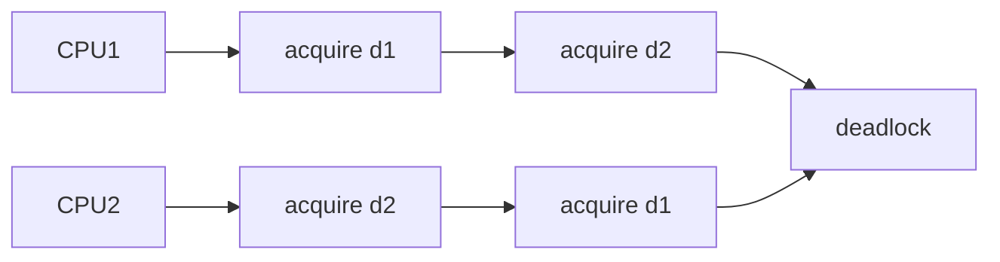
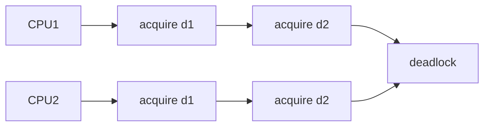
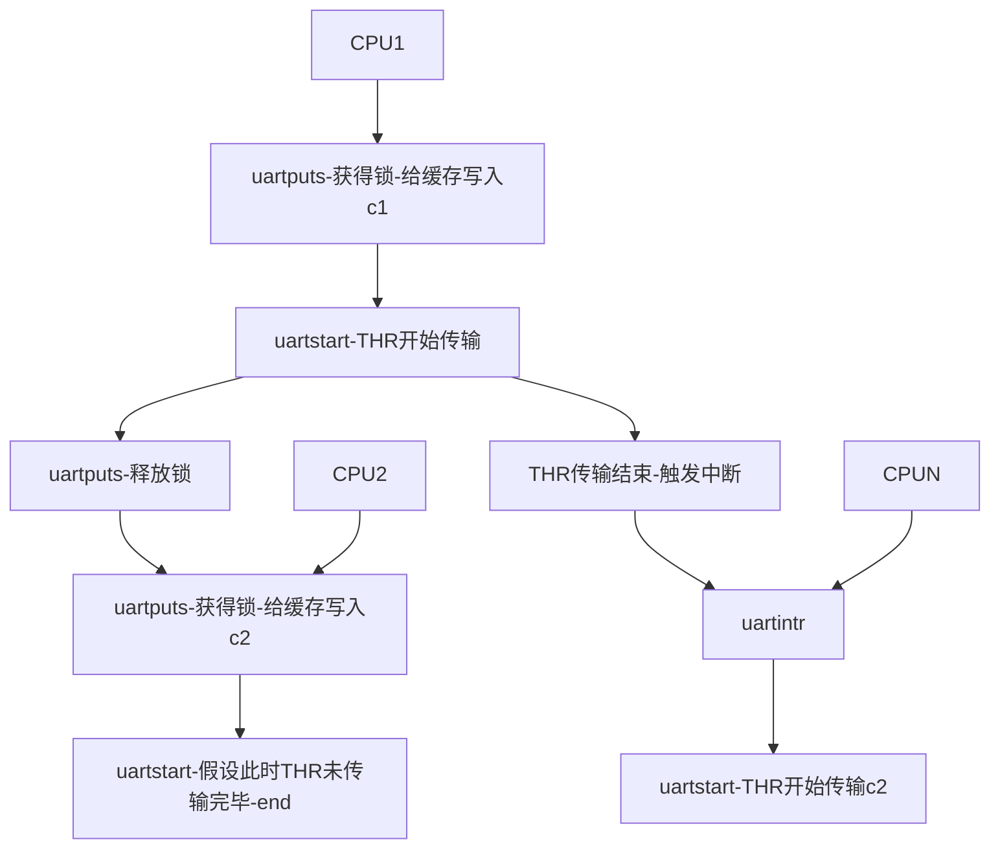

# Lock

## CPU多核并行和锁

### 多核


多核并行运算的必要性源起于单核处理器的发展停滞。图中蓝线代表处理器的单线程性能，可以看到00年代以后，它就达到极限，与此同时，CPU的晶体管数量（最上的深红色线）和核数（黑线）在持续增加，人们开始通过堆核的方式来提高CPU性能。因此现在不管是OS亦或者应用程序都需要利用多核并行来进行优化。

### 锁的必要性

为什么需要锁？正是因为多核并行。不同的核并行地访问一个共享的数据结构的时候，一个核写入该数据时，另一个核可能需要读取该数据，这就会发生**race condition**，导致程序出错。而锁可以保证共享的数据一个时间只被一个核访问和更新，避免race condition。

### Race condition

在前面的Lecture中，我们已经见到了Xv6中使用锁的场景，比如`console`的缓冲区。又比如说`kalloc.c`中的`fmem`

```c
struct {
  struct spinlock lock;
  struct run *freelist;
} kmem;
```

`freelist`这个链表储存了所有空闲的物理页，Xv6使用了自旋锁将这个链表保护起来。比如，在函数`kalloc.c`中的`kfree`函数,在加锁的区间里，`kmem.freelist`被修改了。

```c
void
kfree(void *pa)
{
  struct run *r;

  if(((uint64)pa % PGSIZE) != 0 || (char*)pa < end || (uint64)pa >= PHYSTOP)
    panic("kfree");

  // Fill with junk to catch dangling refs.
  memset(pa, 1, PGSIZE);

  r = (struct run*)pa;

  //acquire(&kmem.lock);
  r->next = kmem.freelist;
  kmem.freelist = r;
  //release(&kmem.lock);
}
```

现在修改`kfree`,注释掉加锁的部分，此时就可能发生**race condition**。

重新编译Xv6，发现可以看似正常的运行，==注意此时有三个核在运行==：


现在运行`usertests`,可以看到确实有一些race condition触发了panic （老师在课堂上展示的时候发生了panic，在我的测试中发生了下图的`FAILED`）。==race condition 可能发生也可能不发生==。


### 性能问题

最后有一个矛盾的问题，多核并行运算本来是为了提高CPU性能，为了保证多核不发生race conditionde地共享资源，我们使用了锁，但锁的出现使得核与核之间的程序执行只能串行，这反而限制了CPU性能。

## race condition的发生和锁的基本用法

### race condition的发生

现在来通过`kfree`来解释race condition的发生

* 首先多core并行运行，需要在脑中有一个图像，多core同时执行kernel的代码，与此同时它们连接到一块内存上。

* 现在构想core0和core1同时在执行`kfree`这段代码,即core0和core1都需要释放一个物理页r，并把它放到 freelist的头部。

  ```c
  r->next = kmem.freelist;
  kmem.freelist = r;
  ```

  由于没有加锁，这段操作并不具有**原子性**。我们并不知道核1和核2哪个代码先执行，所以代码执行顺序可能如下
  
  ```c
  r->next = kmem.freelist;//core0
  r->next = kmem.freelist;//core1
  kmem.freelist = r;			//core1
  kmem.freelist = r;			//core0
  ```


* 结果可能如上图，core0和core1都把自己r的next指向当前的freelist,然后连续更新freelist就会丢失core1释放的物理页。现在返回来看在这个下图的结果就不难理解

  

  

这只是一种坏结果，如果第三个core也参与进来，再考虑`kalloc`的代码，那么可能会出现更奇怪的结果。

解决这一问题的常见方法就是锁

### 锁的基本用法

我们先不看锁是如何实现的，只需要知道锁是一个对象，在Xv6它是一个结构体lock，它维护了锁的一些状态。来看锁的API:

* `acquire`,它以指向锁的指针为参数，==它确保只有一个进程能获得锁==。
* `release`,它也以指向锁的指针为参数，如果其他进程想要获得锁，只有等待获得锁的进程`release`

```c
acquire(&lock);

//critical section

release(&lock);
```

`acquire`和`release`之间的字段叫做**critical section**,这段代码要么一起执行，要么不执行。所以如果使用锁对`kfree`进行保护，就能保证freelist更新的原子性。

如果整个kernel所有的系统调用只有一个锁（coarse_grained lock : 大锁），那么如果一个程序并行地调用不同的系统调用，那么这些系统调用只能串行地进行。幸运的是，更多的场景下，不同的系统函数会使用不同的锁，这些系统函数就能并行地执行。最后

* 锁并不是强制性，这由程序员决定
* 数据结构和锁关联，才能上锁，并需要在适当的场景使用。

## 什么时候使用锁

关于什么时候使用锁，这里给出一个规则

**如果存在这样的情景：两个进程访问一个共享的数据结构，并且其中一个进程会更新共享的数据结构，那么该共享的数据结构就应该加锁**

这样的规则对于某些场景过于严格，对于另外一些场景又过于宽松。

* 事实上，如果两个进程共享一个数据结构，其中一个进程更新数据结构，在一些场景不加锁也是可以正常工作。这么做往往是为了更好的并发度，不加锁的程序被称为lock-free program。
* 在规则的场景以外，也可能需要锁，比如`printf`。Xv6会通过加锁保证字符串原子性地输出。

### 自动加锁的弊端

依据前面的规则，我们操作共享数据结构的时候需要加锁。那么是否需要对共享数据结构的每一个操作都需要自动加锁呢？并不一定

来看一个例子，假如现在有一个rename的调用，它会将会一个文件x从一个目录d1移到另一个目录d2下rename为y。目录作为一个结构体可能是如下存在：

```c
struct {
  struct spinlock lock;
  struct file file[NFILE];
} dir;
```

如果对该数据结构所有操作自动加锁，则上述过程执行逻辑如下

```c
acquire(&d1.lock);
erase x in d1;
release(&d1.lock);
acquire(&d2.lock);
add y in d2;
release(&d2.lock);
```

**这实际是个有问题的场景**了，当执行进程执行完3还没有执行4的时候，在其他进程看来，文件是不存在的。这是不正确的，3到4之间并不具备原子性，这时候如果其他进程想要访问文件就会发生错误。

正确的执行应该如下：

```c
acquire(&d1.lock);
acquire(&d2.lock);
erase x in d1;
add y in d2;
release(&d1.lock);
release(&d2.lock);
```

在涉及如上多个锁的时候，自动加锁就会可能发生错误，所以锁应该和操作关联而不是数据结构。

## 锁的特性和死锁

锁的特性主要有三种

* **Locks help avoid lost updates**。例子就是之前所提的`kfree`释放物理页丢失的过程,锁可以避免这种情况。
* **Locks make multi-step op atomic**。加锁的区间为critical section，所有的操作都会变成一个原子操作，这意味着它不会被其他进程打断。
* **锁可以维护共享数据的不变性**，这里我不完全理解，暂不详谈。

虽然锁有诸多的好处，但不恰当地运用锁将会带来锁特有的问题，最明显的例子就是**死锁(Deadlock)**。

### 死锁1

最简单的场景如下

```c
acquire(&lock);
//some code
acquire(&lock);
//some code
release(&lock);
release(&lock);
```

`acquire`一个锁以后，在critical section再`acquire`同样的锁，这时候就会发生死锁。因为第二个 `acquire`锁必须要等第一个` release`锁以后，所以程序就一直卡在这里了。

Xv6会探测这样的死锁，如果同一个进程多次 `acquire`同一个锁，就会触发panic。

### 死锁2

如果有多个进程并行地`acquire`不同的锁，情况会更有趣,比如CPU1要做`rename("d1/x","d2/y")`,CPU2要做`rename("d2/a","d1/b")`,如下：



假设执行的顺序如下

```c
acquire(&d1.lock);//CPU1
acquire(&d2.lock);//CPU2
acquire(&d2.lock);//CPU1
acquire(&d1.lock);//CPU2
```

实际上3,4行的`acquire`CPU1和CPU2都进行不下去，它们持有彼此需要的锁，程序也会卡住。这种场景也被叫做**deadly  embrace**。

这样的解决方案就是：如果有多个锁，就给锁进行排序。所有的操作都必须要以相同的顺序获取锁。做为一个系统设计者，可以让获得d1锁一直在d2锁的前面，上述情景执行如下：这样任何CPU获得 d1的锁之后，其他CPU都不会进入critical section,也就不会发生死锁的情况。



### 妥协

但是，在一个操作系统中，定义全局的锁的顺序会有些问题。

* 如果一个模块m1中方法g调用了另一个模块m2中的方法f，那么m1中的方法g需要知道m2的方法f使用了哪些锁。因为如果m2使用了一些锁，那么m1的方法g必须集合f和g中的锁，并形成一个全局的锁的排序。**这意味着在m2中的锁必须对m1可见，这样m1才能以恰当的方法调用m2**。

* 但是这样又违背了**代码抽象**的原则。在完美的情况下，代码抽象要求m1完全不知道m2是如何实现的。但是不幸的是，具体实现中，m2内部的锁需要泄露给m1，这样m1才能完成全局锁排序。

## 锁和性能

锁带来了新的挑战，一是死锁，一是破坏了程序的模块化。现在我们回过头看第一节提过的锁和性能的矛盾。

* **拆分数据结构和锁** ：系统最开始的时候只有一个`big kernel lock`（大锁）,那么系统只能被一个CPU运行，这时候和无锁时候是一样的。如果想要去随着CPU数量的增加也提高性能，就应该拆分数据结构和锁 。
* **最好的拆分是一个挑战**：怎么去拆分是一个大问题。比如在我们之前举的例子中的目录数据结构中，我们是否给每个目录关联不同的锁呢？更多的，每个inode是否关联不同的锁，每个进程是否关联不同的锁。寻找更好拆分数据机构和锁的方法，以及拆分以后**设计锁的规则（比如不同锁的排序）**都是比较复杂的问题。
* **重构代码**，拆分大锁以后，需要去重构代码，这意味着不小的工作量。

现在我们知道，为了获得更好的性能，需要拆分出更多的锁，但这引入了大量的工作。基于此矛盾点，平衡锁和性能的开发流程是

* 先以`coarse-grained lock`（大锁）开始。

* 对程序进行测试，观察程序是否能使用多核。**这里的测试很重要**

  1. 如果有一些模块使用了大锁，而另外的模块没有使用大锁，这两个模块就能被并行调用。

  2. ==还有一些模块可能虽然使用大锁，但是它并不会经常被并行地调用==

  考虑到重构代码的成本问题。如果测试成功，那么这里就结束了。

* 如果测试不可以，意味多CPU只能竞争获得锁，串行执行。那么就需要拆分锁，重构代码。

## Xv6中UART模块中锁的使用

我们通过UART中的锁来看看锁的实例

```c
struct spinlock uart_tx_lock;
#define UART_TX_BUF_SIZE 32
char uart_tx_buf[UART_TX_BUF_SIZE];
int uart_tx_w; // write next to uart_tx_buf[uart_tx_w++]
int uart_tx_r; // read next from uart_tx_buf[uar_tx_r++]

```

这是一个并行运算的标准设计（**消费者-生产者模式**），分为三个部分。

* **缓存**。`printf`会写到这里，UART的寄存器从这里读，传输到显示器上。

* **写指针**，指向下一个被写的缓存空槽。

  **读指针**：指向下一个被传输的缓存空槽

* **锁**（在UART中，这是一个coarse_grained lock),维护缓存，写指针，读指针的不变性。


再来看相关的函数

### `uartputs`

```c
void
uartputc(int c)
{
  acquire(&uart_tx_lock);

  if(panicked){
    for(;;)
      ;
  }

  while(1){
    if(((uart_tx_w + 1) % UART_TX_BUF_SIZE) == uart_tx_r){
      // buffer is full.
      // wait for uartstart() to open up space in the buffer.
      sleep(&uart_tx_r, &uart_tx_lock);
    } else {
      uart_tx_buf[uart_tx_w] = c;
      uart_tx_w = (uart_tx_w + 1) % UART_TX_BUF_SIZE;
      uartstart();
      release(&uart_tx_lock);
      return;
    }
  }
}

```

* `uartputs`使用锁保证只有一个进程可以写缓存。这样就不会出现多进程写缓存，互相覆盖。

### `uartstart`

```c
void
uartstart()
{
  while(1){
    if(uart_tx_w == uart_tx_r){
      // transmit buffer is empty.
      return;
    }
    
    if((ReadReg(LSR) & LSR_TX_IDLE) == 0){
      // the UART transmit holding register is full,
      // so we cannot give it another byte.
      // it will interrupt when it's ready for a new byte.
      return;
    }
    
    int c = uart_tx_buf[uart_tx_r];
    uart_tx_r = (uart_tx_r + 1) % UART_TX_BUF_SIZE;
    
    // maybe uartputc() is waiting for space in the buffer.
    wakeup(&uart_tx_r);
    
    WriteReg(THR, c);
  }
}

```

* `uartstart` 依然在锁里，不管是`uartintr`或者`uartputs`调用。`uartstart`会传输字符串到UART的寄存器THR，锁保证了THR寄存器只有一个写入者。

### `uartintr`

```c
void
uartintr(void)
{
  // read and process incoming characters.
  while(1){
    int c = uartgetc();
    if(c == -1)
      break;
    consoleintr(c);
  }

  // send buffered characters.
  acquire(&uart_tx_lock);
  uartstart();
  release(&uart_tx_lock);
}

```

* UART驱动的bottom(`uartintr`)一样使用了锁，这就保证了和UART驱动的top(`uartputs`)并行执行时不会出现race condition。

在阅读`uartputs`和`uartstart`的时候，**我这样想如果`uartputs`放一个字符到缓存，`uartstart`从缓存读一个字符传输显示，那么还需要缓存干嘛？**可实际上，`uartstart`并不一定会读缓存传输显示，因为UART和cpu的工作是**并行的**，所以UART可能还没传输完上一个字符（鉴于I/O设备读写速度大概率远慢于内存）这种情况下，`uartstart`就会结束，因此==缓存的数据写的速度就大于读的速度==，缓存的必要性也就体现出来。 我们来模拟两个CPU的过程来熟悉

### 模拟



## 自旋锁(Spin lock)的实现

先来看自旋锁的结构体,这并不复杂：

```c
struct spinlock {
  uint locked;       // Is the lock held?

  // For debugging:
  char *name;        // Name of lock.
  struct cpu *cpu;   // The cpu holding the lock.
};
```

我们简单构想一下`acqurie`锁的实现，逻辑如下

```c
bool acqurie(struct spinlock * sl){
  while(1){
  	if (sl->locked==0){
      sl->locked=1;
      return true;
    } 
  }
}
```

* 如果锁的locked字段不为0，则说明该锁已经被获取，一直spin
* 直到locked字段为0，说明之前锁持有者`release` 了锁，这时候再把locked=1，该进程就获得了该锁。

**但这是有问题的**，假如两个进程同时读到锁的locked字段为0，那么它们都会获得锁，这就出现了错误。受原子操作的启发，我们很自然地想到如果能把

```c
if (sl->locked==0)
    sl->locked=1;
```

读写locked这段操作整合成==原子性==的就好了。

事实上，Xv6正是基于一个特殊的硬件指令`amoswap`(atomic  memory swap)完成了类似的操作。

```assembly
amoswap addr r1 r2
```

* 这个指令接受三个参数，address,寄存器r1, 寄存器r2
* 这个指令会把address锁住，将M[address]数据放到r2里，r1的数据放到M[address]里。
* 最后再对地址解锁

### `amoswap`的硬件实现

`amoswap`的实现基于内存系统的工作原理

* 如果多处理器共用一个内存控制器，则**使用内存控制器给特定地址加锁**，让处理器执行几个指令以后，再解锁。
* 如果内存位于一个共享的总线上，那么需要总线控制器（bus arbiter）来支持。**总线控制器需要以原子的方式执行多个内存操作**
* 如果处理器有缓存，那么缓存一致性协议会确保对于持有了我们想要更新的数据的cache line只有一个写入者，**相应的处理器会对cache line加锁**，完成两个操作

### 使用`amoswap`实现自旋锁

来看`spinlock.c`中`acquire`函数利用如下获取锁

```c
while(__sync_lock_test_and_set(&lk->locked, 1) != 0)
    ;
```

看它的汇编：


* M[s1]存放着address,a5存放1。
* 利用amoswap.w.aq将a5和M[M[s1]]处的原子性swap
* 如果a5(此时已经获得了locked的值)不等于0，则说明锁已经被其他进程获取，继续循环。

继续来看`release`的实现

```c
 __sync_lock_release(&lk->locked);
```

汇编如下：


* 这里只需要将M[M[s1]]置为0，即设置locked为0

## spinlock实现的更多细节

### __sync_lock_release必要性


### 关中断


### 实现critical section

还需要通过`__sync_synchronize()`函数实现`acquire`和`release`之间操作的原子性，即不会编译器优化将其他部分的指令进入critical section。

```c
//acquire
	while(__sync_lock_test_and_set(&lk->locked, 1) != 0)
    ;

  __sync_synchronize();


//release
  
 	__sync_synchronize();

  __sync_lock_release(&lk->locked);
```

关于_sync_ 的一系列函数见[参考](https://gcc.gnu.org/onlinedocs/gcc-4.6.2/gcc/Atomic-Builtins.html)


