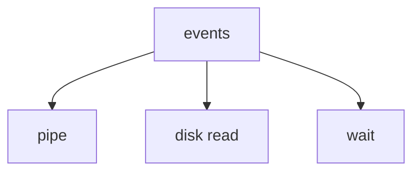
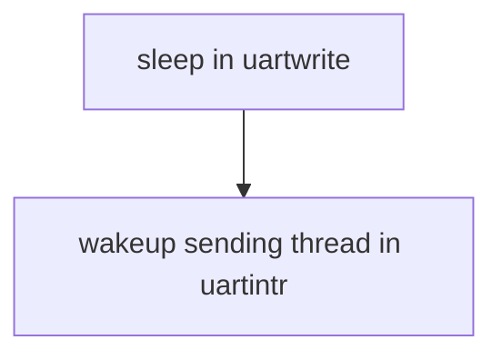
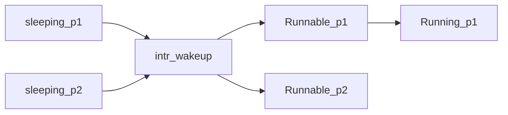
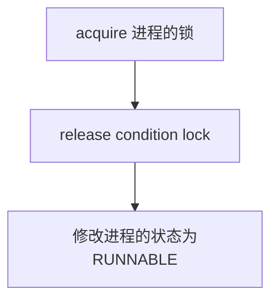
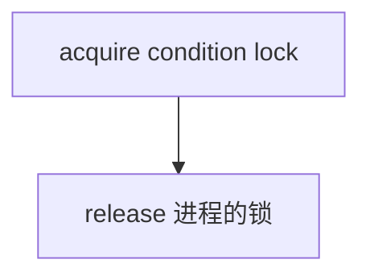
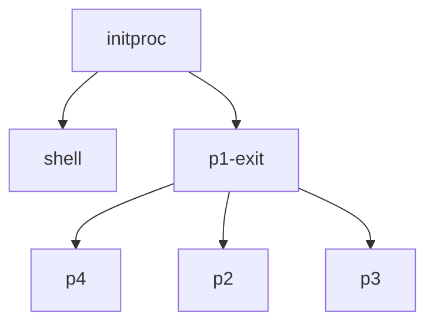
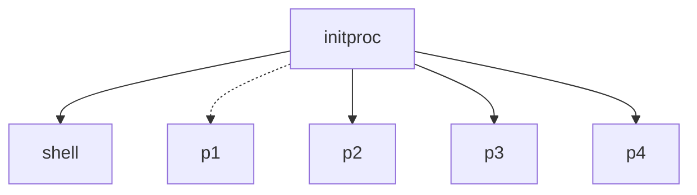

# Sleep & Wakeup

## 线程切换中的Lock

### 原则1 线程切换中(`swtch`中)持有进程的锁

当一个进程想进入休眠状态（这里和进程被强制夺取cpu时是一样的）让出cpu，**即线程切换时，必须要使用进程的锁**。

* 首先获得进程的锁,将进程的状态修改为RUNNABLE，并进入`sched`函数

  ```c
  acquire(&p->lock);
  p->state = RUNNABLE;
  sched();
  //kernel thread
  ```

* `sched`函数会调用`switch`函数，此时会从内核线程进入调度器线程,调度器线程会释放让出cpu的进程的锁。

  ```c
  c->proc = 0;
  release(&p->lock);
  //scheduler thread
  ```

上述过程为何要使用锁的原因已经在上一讲解释。在这里再复习一下：虽然进程的状态已经设为RUNNABLE,但在使用`swtch`函数进入调度器函数之前，cpu上运行的依然是进程的内核线程，其他cpu的内核也在调度中，如果它们发现该RUNNABLE的进程，就会运行对应的内核线程。==两个cpu核运行同一个内核线程会立马导致崩溃。==

### 原则2 线程切换中(`swtch`中)不能持有进程的锁以外的锁

在Xv6内核中,有一个原则：**不允许进程执行`swtch`函数过程，持有除进程`p->lock`外的其他锁**。事实上，在之后讲解的`sleep`等等函数中就秉持这个设计原则。现在来解释该原则的原因：

假设我们在单核cpu的运行两个进程p1和p2,p1在通过`swtch`函数让出cpu前持有p1->lock之外的锁，比如UART或者disk的锁。现在p1让出cpu给p2,p2现在如果也想使用UART或者disk等资源，就会`acquire`该锁，但由于p1持有该锁了，p2就会在`acquire`里一直循环，直到p1释放锁 。然而在单核cpu中p1必须等待p2被调度进p1才能继续执行，这时候系统就陷入了死锁。

逻辑如下

```c
acquire(&disk->lock);//p1 
swtch(&p1->context,&p2->context)//省去了调度器线程
acquire(&disk->lock);//p2
```

你可能会想，p2进程被定时器中断然后调度进p1不就行了，让我们回顾`acquire`的代码

```c
void
acquire(struct spinlock *lk)
{
  push_off(); // disable interrupts to avoid deadlock.
```

第一步就是关中断！这是锁机制里为了防止死锁做的处理（我认为是保证整个critical section的原子性）。 所以无法使用定时器中断来调度。

这只是一个核出现的情况，更多的核可能会有更复杂的情况。所以不持有除进程`p->lock`外的其他锁是必要的。

记住这两条原则，我们现在来看`sleep`和`wakeup`函数。

---

## Sleep& Wakeup实现coordination

线程并不总是线性连续执行,有时候线程需要等待一些事件发生之后才能继续执行



* 假如现在有一个pipe，线程要从pipe中读取一些数据，然而pipe是空的，这时候线程需要停下来，等到**pipe非空的事件**发生以后才继续执行。
* 现在线程要从disk读到内存，这也许是个耗时的过程（尤其是磁碟还需要旋转的情况），线程也需要停下来，等到**读disk结束的事件**发生才继续执行。
* 假如父进程调用`wait`函数等待子进程，那么**子进程结束的事件**也是父进程的等待的世间

以读pipe为例，如果我们知道等待的时间是一个较短的时间，比如是0.1ms，我们可以的一个做法就是

*  **busy-wait** , 让线程一直循环查看pipe是否为空，直到pipe被写入了数据，那么结束循环并读取数据。

但还有些时候，等待的时间是不确定的，或许10分钟pipe才有数据写入，那么这时候循环的策略就很浪费资源。这时候线程还可以采取的策略就是让出cpu直到**pipe非空的事件**发生。

* 这种让出cpu直到等待的事件发生的策略叫**coordination**。在Xv6中，我们使用`Sleep&Wakeup`的实现方式。

### Sleep & Wakeup的接口

我们来看在UART驱动里`uartputc`和`uartstart`里是如何使用`sleep`和`wakeup`接口

```c
void
uartputc(int c)
{
  acquire(&uart_tx_lock);

  if(panicked){
    for(;;)
      ;
  }

  while(1){
    if(((uart_tx_w + 1) % UART_TX_BUF_SIZE) == uart_tx_r){
      // buffer is full.
      // wait for uartstart() to open up space in the buffer.
      sleep(&uart_tx_r, &uart_tx_lock);
    } else {
      uart_tx_buf[uart_tx_w] = c;
      uart_tx_w = (uart_tx_w + 1) % UART_TX_BUF_SIZE;
      uartstart();
      release(&uart_tx_lock);
      return;
    }
  }
}
```

* 如果UART的缓存区已经满了，因为这时候因为不知道UART的寄存器什么时候传输缓存的字符，该线程选择`sleep`，等待**UART缓存区非满的事件**

```c
void
uartstart()
{
  while(1){
    if(uart_tx_w == uart_tx_r){
      // transmit buffer is empty.
      return;
    }
    
    if((ReadReg(LSR) & LSR_TX_IDLE) == 0){
      // the UART transmit holding register is full,
      // so we cannot give it another byte.
      // it will interrupt when it's ready for a new byte.
      return;
    }
    
    int c = uart_tx_buf[uart_tx_r];
    uart_tx_r = (uart_tx_r + 1) % UART_TX_BUF_SIZE;
    
    // maybe uartputc() is waiting for space in the buffer.
    wakeup(&uart_tx_r);
    
    WriteReg(THR, c);
  }
}
```

* 在将缓存的字符写到`THR`寄存器前，需要`wakeup`前面sleep的线程，使其继续执行。`sleep`和`wakeup`函数总是成双出现的。
* `sleep`第一个参数被叫做`sleep channel`,这个数值指向内容是什么并不重要，关键是作为一个地址，**它代表了线程等待的事件**，将于`wakeup`的参数对应匹配，使得`wakeup`可以唤醒等待该线程。
* `sleep`第二个参数是锁，后面将会介绍的原因。如果没有这个参数，只是睡眠等待特定的事件，可能会出现**lost wakeup**的情况。

---

## Lost Wakeup

### 无锁的Sleep&Wakeup

在`sleep`的接口我们可以看到，`sleep`的第二个参数是一个锁。为了解释为什么需要锁的参数，现在我们通过构想一个无锁的`Sleep&Wakeup`，来看看它会导致的问题--**Lost wakeup** 。

称该无锁的`sleep`函数为`broken_sleep(chan)`,它应该需要做(伪代码如下)：

```c
p->state=SLEEPING
p->chan=chan
swtch()
```

* `broken_sleep(chan)`会修改进程的状态为SLEEPING，使其不可被调度。（*准确来说，在内核调度的都是用户进程对应的内核线程*)
* 我们需要知道进程等待的事件：所以在`proc`结构体有`chan`字段，要将传进来的参数赋给它。
* 调用`swtch`进入调度器线程，进行调度。

对应的`wakeup(chan)`则应该做

```c
for each p in proc
  if (p->state==SLEEPING  &&  p->chan=chan)
    p->state==RUNNABLE
```

现在我们使用这两个接口，以UART驱动的`uartwrite`和`uartintr`为例

### broken_sleep&Wakeup 1

```c
void uartwrite(char buf[],int n){
  int i=0;
  while (i<n)
  {
    while (tx_done==0)
    {
      broken_sleep(&tx_chan);//sleep the sending thread
    }
    WriteReg(THR,buf[i]);
    i+=1;
    tx_done=0;
  }
}

```

 ```c
 void
 uartintr(void)
 {
   if (ReadReg(LSR)&LSR_TX_IDLE){
     tx_done=1;
     wakeup(&tx_chan);//wakeup the sending thread
   }
 }
 ```

* 以上就是重构`uart`中的代码使用`broken_sleep`的例子，`tx_done`是用来判断寄存器`THR`是否传输完成的变量。
* 两个函数缺个锁来协调工作，原因如下
  1. 它们有共同维护的数据`tx_done`。
  2. 它们都需要访问UART硬件，==通常来说，让两个线程并发访问Memory mmaped register是错误行为== (其实这里我有点困惑硬件上的支持，即便`uartwrite`和`uartintr`读写的是不同寄存器也是不支持的嘛？加锁是必要的，因为`uartwrite`是有可能被两个线程运行的，那么此时读的就是同一个寄存器)。

### broken_sleep&wakeup 2

在哪里加锁是一个问题，`uartintr`可以这样做

```c
void
uartintr(void)
{
  acquire(&uart_tx_lock);
  if (ReadReg(LSR)&LSR_TX_IDLE){
    tx_done=1;
    wakeup(&tx_chan);//wakeup the sending thread
  }
  release(&uart_tx_lock);
}
```

但`uartwrite`却很难处理，如果我们保障发送一个字符的过程中持有锁，如下

```c
void uartwrite(char buf[],int n){
 
  int i=0;
  while (i<n)
  {
    acquire(&uart_tx_lock);
    while (tx_done==0)
    {
      broken_sleep(&tx_chan);//sleep the sending thread
    }
    WriteReg(THR,buf[i]);
    i+=1;
    tx_done=0;
    release(&uart_tx_lock);
  }
}
```

* 这显然是不行的，如果`uartwrite`这样做,`uartwrite`一旦进入` while (tx_done==0)`循环，就在等待`uartintr`设置`tx_done=1`,**然而于此同`uartwrite`持有锁，这使得`uartintr`只能在`acquire(&uart_tx_lock)`里自旋**。

### broken_sleep&wakeup 3

现在来修改锁的位置

```c
void uartwrite(char buf[],int n){
  acquire(&uart_tx_lock);
  while (i<n)
  {
    while (tx_done==0)
    {
      release(&uart_tx_lock);
      broken_sleep(&tx_chan);//sleep the sending thread
      acquire(&uart_tx_lock);
    }
    WriteReg(THR,buf[i]);
    i+=1;
    tx_done=0;
  }
  release(&uart_tx_lock);
}
```

这样看起来解决了以上的死锁问题，却带来了新的问题**Lost wakeup**。


* 编译结果如上，输出一些字符后就停住了，直到随意输入一个字符 。

```c
release(&uart_tx_lock);
//这是因为在这个位置，由于释放了锁，所以uartintr可以获得锁，wakeup了尚未进入sleep的sending thread(uartwrite)
broken_sleep(&tx_chan);
acquire(&uart_tx_lock);
```

* ==注释是导致Lost wakeup发生的位置==,由于`wakeup`先于`sleep`修改了进程的状态，所以`sleep`的进程没法醒过来了，这就是Lost wakeup。

每次的发送字符到 THR寄存器上后，正常顺序应该为



所以解决Lost wakeup核心就是保证如下执行流程的原子性，但`WriteReg`后就有UART传输完毕发生中断的可能性，所以在`broken_sleep(&tx_chan)`前释放锁是不对的。

```c
WriteReg(THR,buf[i]);
i+=1;
tx_done=0;
while (tx_done==0)
    {
      broken_sleep(&tx_chan);
    }
```

* 所以这就是问题所在！`Sleep&Wakeup1`和`Sleep&Wakeup2`展示了==进入 `broken_sleep(&tx_chan)`时既不能持有锁也不能释放锁==。具体如何做就看下一节

### tx_done和too much wakup

最后需要说明`tx_done`的必要性，我们先来看看没有`tx_done`的代码

```c
void uartwrite(char buf[],int n){
  acquire(&uart_tx_lock);
  int i=0;
  while (i<n)
  {
    WriteReg(THR,buf[i]);
    sleep(&tx_chan,&uart_tx_lock);
    i+=1;
  }
  release(&uart_tx_lock);
}
```

```c
void
uartintr(void)
{
  acquire(&uart_tx_lock);
  if (ReadReg(LSR)&LSR_TX_IDLE){
    wakeup(&tx_chan);//wakeup the sending thread
  }
  release(&uart_tx_lock);
}
```

* 如果只有一个线程调用`uartwrite`，如上的操作是没有问题。

* 但假如有多个线程比如拍p1或者p2调用`uartwrite`,那就会出现唤醒的错误

  我就叫它**too much wakup**，现在回过头来看wakeup的伪代码

```c
for each p in proc
  if (p->state==SLEEPING  &&  p->chan=chan)
    p->state==RUNNABLE;
```

发生中断以后，可以看到在`wakeup`内部，只要是在处于SLEEPING状态并且对应的事件符合`wakeup`需要唤醒的事件，它就统统唤醒，这会出问题 。



假如p1先运行，它会抢到锁，霸占UART，这时候THR寄存器又在传输了，但p1释放锁后作为同样被唤醒的p2也可能继续运行，它并不知道THR寄存器在传输，而是写THR寄存器，这就会出错。

* 这进而引申出一个更普遍的问题，那就是==进程被唤醒以后，可能发现其等待的事件已经被其他唤醒的进程使用了，所以还得继续sleep==。解决策略就是在`sleep`外添加`while(tx_done == 0)`这样的循环。**Xv6所有使用`sleep` 的场景都加上了  `while`循环**。

---

## 避免Lost wakeup

我们要做将`sleep`设计得复杂一点来避免**Lost wakeup**

* 具体的策略就是将事件对应的锁（我们称它为 **condition lock**）传进`sleep`函数，在`sleep`里会修改进程状态的同时释放锁，或者这两个操作应该合在一起具有原子性。这样就可以防止前一节的释放锁后进程状态还不是SLEEPING但被中断打断程序导致lost wakeup。
*   `wakeup`执行的时候也应该持有condition lock，但不同的是，它不需要传该锁进函数。

现在来看`sleep`和`wakeup`的函数

### ` sleep`函数 

```c
void
sleep(void *chan, struct spinlock *lk)
{
  struct proc *p = myproc();
  
  // Must acquire p->lock in order to
  // change p->state and then call sched.
  // Once we hold p->lock, we can be
  // guaranteed that we won't miss any wakeup
  // (wakeup locks p->lock),
  // so it's okay to release lk.
  if(lk != &p->lock){  //DOC: sleeplock0
    acquire(&p->lock);  //DOC: sleeplock1
    release(lk);
  }
  // Go to sleep.
  p->chan = chan;
  p->state = SLEEPING;
  sched();
  // Tidy up.
  p->chan = 0;
  // Reacquire original lock.
  if(lk != &p->lock){
    release(&p->lock);
    acquire(lk);
  }
}
```

* 在进行调度的前半段，需要做三件事
  1. 释放传入的锁`lk`(如开头所说的，我们需要释放condition lock，调度前释放)
  2. 获得进程`proc`的锁（ 如开头所说，线程调度前，需要进程的锁）
  3. 修改进程的状态为RUNNABLE。

这三件事合在一起应当具有原子性，它不应该被中断打断发生调度。所以顺序应该如下



### 插播：嵌套锁的开关中断

我们之前知道`acquire`函数会关中断,`release `会开中断，但出现嵌套锁的时候,情况却复杂点。

以依次获得下面三个锁为例

```c
acquire(&lock1);
acquire(&lock2);
acquire(&lock3)；
```

* 情况是这样的，获得Lock1的时候，确实会关中断，同时会压一个lock到栈(Xv6的处理并不会区分具体是哪个锁，因为弹栈锁的顺序并不是确定的)。到了获得lock2后，就没必要关中断，但会继续压栈。lock3类似


```c
release(&lock1);
release(&lock3);
release(&lock2);
//需要特别注意的是，锁的释放顺序并不确定，这里只是假定了一种情况。
```

* 释放锁的时候，并不一定就会开中断，而是弹出一个lock，同时判断栈是否已经为空了，如果栈为空，才关中断。如上代码释放的时候，直到`release(&lock2)`才能开中断。

为什么要说这个呢？因为这样的机制才保证了调度器前所有操作（如下的代码）的==原子性==。**先获取进程的锁，再释放传进来的锁，**整段都是关中断的。

```c
  if(lk != &p->lock){  
    acquire(&p->lock); 
    release(lk);
  }
  p->chan = chan;
  p->state = SLEEPING;
```

### `wakeup`函数

现在再来看`wakeup`函数

```c
void
wakeup(void *chan)
{
  struct proc *p;

  for(p = proc; p < &proc[NPROC]; p++) {
    acquire(&p->lock);
    if(p->state == SLEEPING && p->chan == chan) {
      p->state = RUNNABLE;
    }
    release(&p->lock);
  }
}
```

* `wakeup`做的就简单多了，进入`wakeup`函数已经持有condition lock,遍历获取每个进程的锁，现在修改等待chan事件处于SLEEPING状态的进程就可。

### sleep的后半段

在`sleep`的进程被唤醒以后，通过 `swtch`函数，又会到该进程的`sleep`函数，它会重新获得condition lock 。



### 避免Lost wakeup到底在做什么

现在我们反思：

Lost wakeup发生的场景其实就是`wakeup`先于`sleep` 修改了进程的状态。为了保证这一点，最核心的一点就是在`sleep`函数中，==先获取进程的锁，再释放condition  lock==。这些规则也是有用。

* 调用`sleep`时需要持有condition lock，这样`sleep`函数才能知道相应的锁。
* `wakeup`需要同时持有两个锁才能查看进程

---

## semaphore

---

下面来说一件很重要的事，那就是进程的关闭。

在Xv6中，进程如果要关闭，需要释放用户的内存，释放页表，释放`trapframe`和清除进程的种种状态。如果我们要做到这些，会面临两个问题

* **首先我们不能单方面直接关闭另一个线程**，因为
  1. 另一个进程可能正在另一个核上运行，正在使用着栈。
  2. 另一个进程可能持有着锁
  3. 另一个进程可能正在更新一个内核的数据结构
* **进程不能自己释放自己的资源**，这是因为只要进程还在运行代码，它就一定需要它自己的栈和进程的页表。

记住这两个问题。在Xv6中，我们可以使用`exit`和`wait`配合来关闭一个进程，这里面就会用到`sleep&wakeup`。

## `exit`和`wait`

### `exit`

在子进程中使用`exit`,以回收如下进程p1为例，p1会调用`exit`



```c
	acquire(&p->lock);
  struct proc *original_parent = p->parent;
  release(&p->lock);
  
  // we need the parent's lock in order to wake it up from wait().
  // the parent-then-child rule says we have to lock it first.
  acquire(&original_parent->lock);

  acquire(&p->lock);

  // Give any children to init.
  reparent(p);

  // Parent might be sleeping in wait().
  wakeup1(original_parent);

  p->xstate = status;
  p->state = ZOMBIE;

  release(&original_parent->lock);

  // Jump into the scheduler, never to return.
  sched();
```

* 获取父进程的锁，并唤醒父进程（需要注意的是这里的`wakeup1`传入的参数是进程）。
* **需要将当前进程的所有子进程的父进程修改为`initproc`**,转变如下图：




* 修改当前进程的状态为 ZOMBIE（即进程已经退出，但内存尚未释放）
* 释放父进程的锁

### `wait`

父进程使用`wait`

```c
int
wait(uint64 addr)
{
  struct proc *np;
  int havekids, pid;
  struct proc *p = myproc();

  // hold p->lock for the whole time to avoid lost
  // wakeups from a child's exit().
  acquire(&p->lock);

  for(;;){
    // Scan through table looking for exited children.
    havekids = 0;
    for(np = proc; np < &proc[NPROC]; np++){
      // this code uses np->parent without holding np->lock.
      // acquiring the lock first would cause a deadlock,
      // since np might be an ancestor, and we already hold p->lock.
      if(np->parent == p){
        // np->parent can't change between the check and the acquire()
        // because only the parent changes it, and we're the parent.
        acquire(&np->lock);
        havekids = 1;
        if(np->state == ZOMBIE){
          // Found one.
          pid = np->pid;
          if(addr != 0 && copyout(p->pagetable, addr, (char *)&np->xstate,
                                  sizeof(np->xstate)) < 0) {
            release(&np->lock);
            release(&p->lock);
            return -1;
          }
          freeproc(np);
          release(&np->lock);
          release(&p->lock);
          return pid;
        }
        release(&np->lock);
      }
    }

    // No point waiting if we don't have any children.
    if(!havekids || p->killed){
      release(&p->lock);
      return -1;
    }
    
    // Wait for a child to exit.
    sleep(p, &p->lock);  //DOC: wait-sleep
  }
}
```

* 获取进程的锁。
* 进入一个大循环，每次都将都判断是否有处于ZOMBIE的子进程，如果存在，就用`freeproc`回收子进程的所有资源。

* 如果不存在就进入`sleep`。

在这个使用`sleep&wakeup`关掉子进程的过程中，==父进程的锁是condition lock==。在使用`sleep&wakeup`的时候，确定什么是condition lock是很重要的。

使用`exit`和`wait`共同才组成完整的进程关闭，这可以解决之前的两个问题。

## kill


