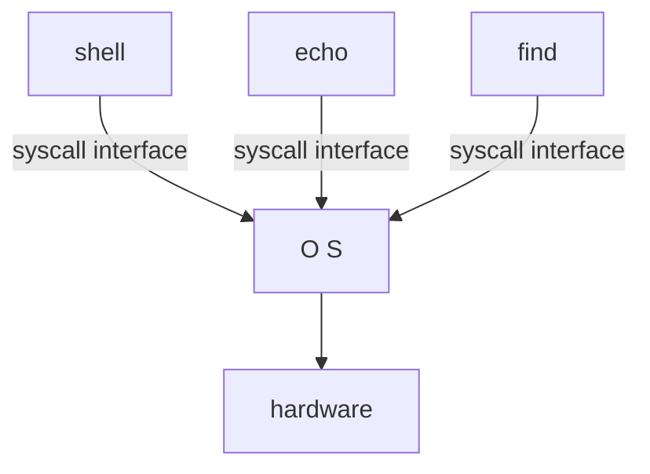
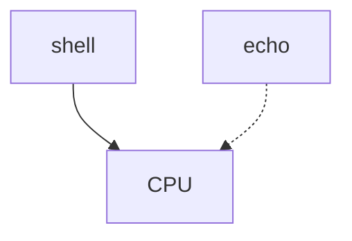
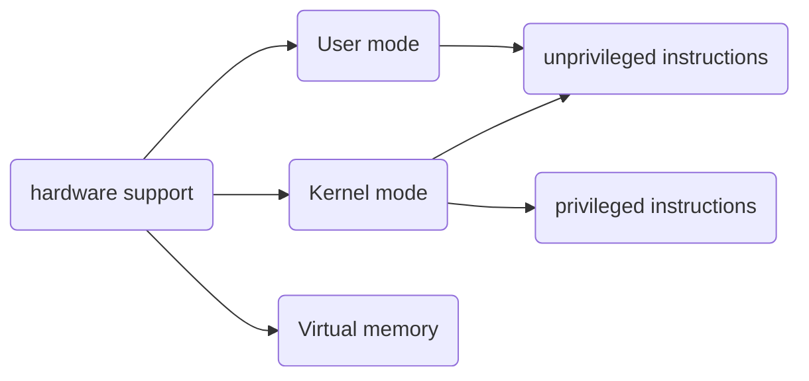
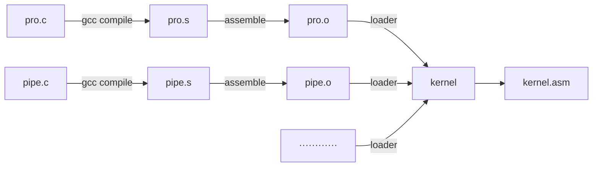
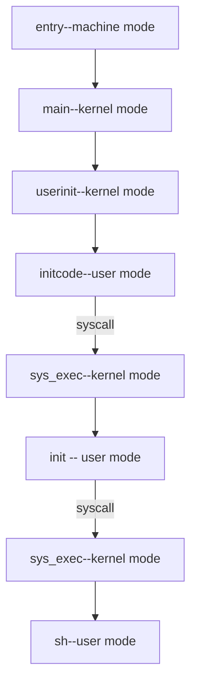

# OS Organization and System Calls

## Isolation




操作系统（OS）是硬件（hardware）和应用程序的中间体。下面将假想没有OS的情况下，从隔离性（**isolation**）（所谓的隔离性在我的理解看来有两个含义，1. 指应用程序与hardware的隔离，2.指应用程序与应用程序的隔离。下面从隔离性的角度讲述为什么需要OS。

### CPU

如下图，多个程序需要使用CPU时，需要保证协同调度(Cooperative Scheduling)的机制，即`shell`运行一段时间后，需要让`echo`也能有机会运行。可下图的设计不能保证这种机制，比如`shell`程序中有死循环，那么`echo`永远也无法获取CPU。



### Memory

如果应用程序直接运行在硬件资源如物理内存上，`shell`和`echo`的内存之间是没有边界的。比如内存地址0x1000被`shell`占有，如果`echo`程序将数据存储在0x1000，`echo`就会覆盖`shell`程序内存的内容。


以上的两点问题对应着OS实现的两个机制

1. 多进程对CPU的分时复用（==Multiplexing==）
2. 物理内存的隔离性（==Isolation==）

### 从Isolation的角度看Unix接口

**接口通过抽象硬件资源，从而使强隔离性成为可能性.**即:普通的应用程序会通过Unix接口使用硬件资源，但它又不能直接使用硬件资源，OS将帮助应用程序完成这一过程，OS将会实现Multiplexing和Isolation。

1. 接口`fork`创建了进程(process) ,但实际要使用的是CPU。process其实是对CPU的抽象。这并不意味着CPU和process的一一对应，以RISC-V处理器为例，它有四个核，当有四个process时，可以做到一个process占用一个核。但有更多process时，则需要OS调度process是实现分时复用。

   ```mermaid
   graph  LR 
   A[proc1]-->B[CPU]
   C[proc2]-->B[CPU]
   D[proc3]-->B[CPU]
   ```

2. 应用程序使用接口`exec`时需要传入一个文件名，而这个文件名对应着一个内存映像（如下图）。但应用程序并不能直接访问这段物理内存。


3. 最后一个例子是files，files是对磁盘的抽象。在Unix中，我们可以对files命名，读写，而OS将会决定files和磁盘中块的对应。

   

## Denfensive

**OS需要应对恶意的应用程序**

1.  首先不能因为应用程序有意或者无意地向系统调用传入一些错误参数就导致OS崩溃。
2. 应用程序不能打破对它的隔离。应用程序可能是由攻击者写出来，它可能打破对应用程序的隔离进而控制内核，有了内核的控制能力，你可以做任何事情，因为内核掌握这所有硬件资源。


## Hardware对Isolation的支持



Hardware对强隔离的支持包括了：**user/kernel mode**和**virtual memory**

### user/kernel mode

CPU用某个控制寄存器的一个模式位(mode bit) 来表示操作模式，当mode bit设置为0时，即为user mode,CPU只能运行普通权限指令（unprivileged instructions）；当mode bit设置为1，即为kernel mode,CPU可以运行包括特定权限指令(privileged instructions)的所有指令。

1. ###### unprivileged instructions 有两个寄存器相加的ADD指令，两个寄存器相减的SUB指令，跳转指令JRC等等。
2. privileged instructions主要是操纵硬件的和设置保护的指令，例如设置page table寄存器，关闭时钟中断等等。在处理器上寄存器会保存各种状态，而privileged instructions也可以使用这些状态寄存器。

user mode/kernel mode的隔离性体现在，用户空间运行的`ls`和`echo`程序处于user mode，~~OS则处于kernel mode~~(==这里写的是有问题的，`Xv6`的全部操作系统服务确实是处在kernel mode，但这是宏内核（Monolithic kernel）,微内核并非如此==)。例如ls的程序调用`read/write`时会需要从user mode转化成kernel mode。


下面将介绍如何具体实现这一转化的过程

####  user/kernel mode的转化

将控制权从应用程序转移到内核这一个过程被称为**Entering Kernel**。 在我们使用的`RISC-V`指令集中，有一个叫 `ecall`的指令，`ecall`会接收一个数字参数，数字参数对应着应用程序想要调用的`syscall`。`ecall`会跳转到内核的一个特定位置，这就完成了从user mode到kernel mode的转化。

以使用系统调用`fork()`为例，它并不能直接使用OS中的`fork`函数，而是调用`ecall`指令，并将`fork`对应的数字（==systemcall number==）作为参数传给`ecall`,之后通过`ecall`跳转进 `kernel`,由`syscall`实际意义上地调用`fork`函数。


###  virtual memory

基本所有的CPU都会支持virtual memory，CPU包含了page table,而page table会将virtual memory addr和physical memory addr做了对应。


在OS的设置下，每一个process都一个自己独立的page table，这意味着一个process不能访问其他process的physical memory addr,因为其他process的physical memory addr甚至都不在该page table中。这样就做到了memory isolation。

每一个用户进程的都有如下的virtual memory视图，它们的地址都是从0到$2^n$。virtiual memory的具体内容将在Lecture3中讲述。


## Monolithic kernel and Micro kernel

使用系统调用之后，控制权从应用程序转移到了`kernel`，之后kernel负责具体的功能并检查参数保证不被坏参数欺骗，所以`kernel`也被称为可被信任的计算空间（Trusted Computing Base），即TCB。可以看出，`kernel`对于安全性的要求很高，既然如此，是否要让所有的OS代码都运行在 kernel mode上呢？不一定。


### 宏内核(Monolithic kernel)

整个操作系统代码都运行在kernel mode，大多数的Unix操作系统实现都运行在kernel mode上，例如`Xv6`,这种形式被称为Monolithic Kernel Design（[宏内核](https://en.wikipedia.org/wiki/Monolithic_kernel)）。

1. 优点：tight integration 
2. 缺点：more codes,more bugs


### 微内核(Micro kernel）

将大部分的OS代码运行在kernel的设计被称为Micro Kernel Design（[微内核](https://en.wikipedia.org/wiki/Microkernel)）。在这种模式下，希望在kernel mode中运行尽可能少的代,内核只有非常少的几个模块

1. IPC（ InterProcess Communication进程间通信;
2. 基本虚拟内存(VM)的支持，可能只支持了page table;
3. 分时复用CPU（Multiplexing）支持.


而文件系统则和普通的应用程序一样运行在user mode。这样做的好处当然是为了解决Monolithic kernel的冗余,但也会带来不同mode之间切换带来的损耗。以`shell`为例，如果它希望调用文件系统，那么就需要两次user/kernel mode的来回跳转。


## 编译运行kernel

下面将看看`Xv6`这个OS是如何具体实现的:

`Xv6`主要分为三个部分，分别位于如图的三个文件夹下。


1. 第一个是kernel的部分，*ls kernel*以后可以看到kernel目录下的所有文件。其中c文件全体被编译成下图中绿色的==`kernel`==文件（这是一个二进制的文件，运行在kernel mode)。

   

2. 第二个是user的部分，该目录下的程序是一些用户程序，运行在usr mode。在Lab1中，我们已经在这个文件夹下写了一些程序。
3. 最后是mkfs，它会创建一个空的文件image（在学完文件系统后，将进行补充）。

现在解释kernel里的c文件是如何编译成`kernel`的二进制文件。和以上三个文件夹处于同一目录下的`Makefile`文件会读取c文件（以`pro.c`为例），调用gcc编译器（*compile*），生成一个`pro.s`(`RISC-V`汇编语言文件)。对这个`pro.s`调用汇编解释器(assemble)，生成二进制格式的汇编文件`pro.o`。


`Makefile `将会对所有的C文件做这样的操作，之后加载器(Loader)将会收集所有的`.o`文件，生成最后的kernel文件。为了便于我们的的学习，`Makefile`文件将会对`kernel`文件反汇编生成`kernel.asm`。在`kernel.asm`中，我们将看到 `RISC-V`汇编语言描述的`kernel`。




## QEMU

`qemu`是`RISC-V`指令集CPU的模拟C程序，我们的`kernel`将在这上面运行。`qemu`的内部是一个循环，它重复地做以下三件事。

1. 读取4字节或者8字节的`RISC-V`指令。

2. 解码该`RISC-V`指令，并找到对应的操作码（op code）。

3. 最后在软件执行该指令。

   ```c
   while(true):
   			read instruction 
         decode instruction(such as add/sub)
         execute instruction
   ```

有两点需要说明

1. `qemu`的循环会需要维护寄存器。
2. `qemu`支持真正的多线程。


## Xv6的启动


### 带有gdb调试运行Xv6

下面将带`gdb`运行`Xv6`，由于缺乏RISC-V 64位Linux的`gdb`，这里并不按照课程中的方法调试`kernel`，而是按照[此文的方法](https://zhuanlan.zhihu.com/p/331492444)直接使用`gdb-multiarch`调试`kernel`。

首先带着`gdb`运行“启动CPU”，即运行`qemu`。

```shell
make CPUS=1 qemu-gdb
```

来看看传给`qemu`的参数

1. `-kernel` : 传递了`kernel/kernel`，即之前所描述的内核二进制文件。这里其实就是`kernel`在`qemu`上运行的这一过程模拟了`Xv6`的内核运行在`RISC-V`处理器上这一过程。

2. `-m `：表示该虚拟机的内存,为128M。
3. `-smp` ：表示该虚拟机的CPU数量，为1。
4. `-drive `：表示该虚拟机的硬盘驱动，传入的为同目录下的`fs.img`。

接下来再打开一个新的终端，键入。

```shell
gdb-multiarch kernel/kernel
```


此时就可以对`kernel`进行调试了。

---


### kernel的入口


我们在上图来看看`kernel.asm`文件的开头。首先注意`kernel`的第一个指令储存在地址0x80000000处，这是一个被`qemu`认可的地址（也就是说如果要`kernel`运行在`qemu`上，**第一个指令需要在地址0x80000000处**，这一点也可以在生成`kernel`的`kernel`加载器得到体现，即`kernel.ld`脚本)。然后注意到一点，第一个函数为`_entry`。

再来看看指令，可以注意不同`RISC-V`指令的字节数不一定相同，到`addi`（相加的指令）是2个字节,而`csrr`(`mhartid`表示控制系统寄存器（Control System Register）,此指令的含义是将`mhartid`的数据加载到`a1`寄存器中)则是4个字节。

暂停一下，来看看`kernel.ld`。

*在这里对ld脚本稍作补充，ld脚本主要功能就是将多个.o文件和.a文件链接成一个可执行文件。它其实就是之前提到的将多个.o文件链接成kernel的loader。*


有三点需要注意，

  1.`ENTRY(_entry)` 指明了`kernel`代码段的执行入口：`_entry`，这正是上文所提的`kernel`的第一个函数。

2. `. = 0x80000000` 指明了`kernel`的起始虚拟地址，这正是`kernel`代码段（即`.text`）第一个指令的地址。

3. `. = ALIGN(0x1000)`表示`kernel`代码段需要保证4KB对齐(其实就是页的大小对齐)。

   

---

### 第一个shell

好，下面回到用`gdb`对`kernel`的调试，


1. 

   设置第一个断点，进入`_entry`。此时还不存在内存分页，而且还处于独立于kernel/user mode之外的machine mode，还没有隔离性。


2. 

   设置第二个断点，进入`main`，模式转化为kernel mode。在 `gdb`  中键入`layout split`,可以看到`main`的码源。`consoleinit()`将初始化console，这样才可以打印。(这里对console的解释不够详实，将在后面的lecture中展开)。
   
   
   
   不断在`gdb`中键入`n`,跳到打印结束，就可以在启动qemu的终端看到`xv6 kernel is booting`的字样。
   
   
   
   
   
   
   
   

3. ​    

   接下来`main`中将做一系列的初始化，这些将在后面的lecture中一一介绍。


4. 

   下面这一步将会创建第一个user process(用户进程)，键入`si`进入userinit。在userinit中，它会启动了一个小程序initcode，这个小程序直接由二进制写成，将运行在user mode下

   
   
   
   
   为了搞清楚initcode的指令，可以在user/initcode.S里看到汇编版本。我们关注前四个指令。
   
   

1. 将init中的地址加载到a0寄存器中。
2. 将argv中的地址加载到a1寄存器中。
3. 将SYS_exec(`exec`对应的systemcall number)加载到a7寄存器上。(*一点补充，la和li都是*`RISC-V`指令集的伪指令，前者加载地址，后者加载立即数)。
4. 调用`ecall`。

5.initcode是第一个user程序，为了搞清楚它系统调用了什么，我们设置第三个断点，进入syscall：


需要注意的是syscalls函数采用的是函数指针数组（如下）。


`num=p->trapframe->a7`会读取systemcall number,这决定了将要读取的系统调用的函数。打印num，这正是`exec`的systemcall number，与initnode的指令完全相符。事实上，我们也可以在syscall.h里看到每一个系统调用函数和其数字的对应。


接下里syscall会调用`sys_exec`。以上的过程刚好可以让我们回顾一下这张图


6. 

   我们跳进`sys_exec`看看，首先它会从用户空间读取参数，即path，也就是`exec`的文件名。

   

   

打印path。这表明initcode通过系统调用`exec`了init程序，这也同样是一个user程序。

7.如果继续运行代码，依然会陷入syscall的断点，这是因为init程序做了类似的事情，它通过系统调用`fork`出一个子进程，然后系统调用`exec`执行sh程序，这样第一个shell就运行起来啦！


总结下来，从qemu开始运行到第一个shell运行主要经历了如下的过程。至于其中为什么这么做，比如

1. **为什么需要init程序，而不直接调用sh程序**
1. initcode程序为什么要写成二进制。
1. 为什么在init程序里需要配置console（之前已经在main里配置了）

希望在后面的lecture有所介绍。



