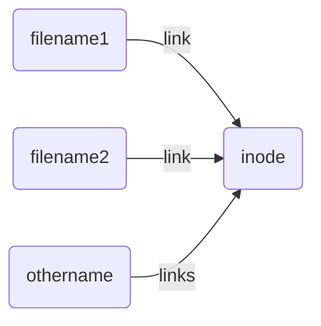

# 第一章 操作系统接口

## 1.1进程和内存

#### fork与exec

首先他们都是*系统调用*的接口

* fork在父进程中创建了一个子进程，并使用wait在父进程中等待子进程结束，回收。

**fork返回值在子进程中为0，父进程中为子进程的pid**


```C{}
int pid=fork();
if (pid>0){
    pid=wait((int*)0);//wait()函数参数的是一个地址，调用后参数是子进程的退出状态
}else if (pid==0){
    exit(0);
}
```

* exec有两个参数，可执行文件的文件名与字符串参数数组

```C{}
char* argv[3];
argv[0]="echo";
argv[1]="hello";
argv[2]=0;
exec("bin/echo",argv);
```

|  | exec | fork |
|---- | ---- | ---- |
| 内存内容是否相同  | 不同  |相同|
|是否~~覆盖~~来原有的内存空间|是|否|


---

## 1.2 I/O和文件描述符


### 文件描述符

文件描述符是一个强大的抽象，它在名称上指向文件，实际上可以指向任何I/O对象，即也可以指向*设备*和或者*管道*，在下面的描述中默认这一点。在Xv6中最小的文件描述符，如果出现了负值则说明出现了错误。


### write和read

read和write都是*系统调用*的接口，以==字节==为单位读取文件（通过*文件描述符*）。需要注意一点，buf本质上是指针，第二个参数需要传入指针。

```C
write(fd,buf,n) //fd为文件描述符，
read(fd,buf,n)//buf为读或者写的字符串
```
1. 引用文件的==每个==文件描述符都有一个与之关联的*偏移量*，且每次read和write都从此偏移量处开始读取或者写入。

2. 每个进程都有一个文件描述符的*私有空间*，里面有三个从零开始的打开的文件描述符。进程从==文件描述符0==(标准输入*input*)读取，将输出写入==文件描述符1==（标准输出*output*)，并将错误写入==文件描述符2==(标准错误)。


3. 当文件没有更多的字节可读时，read返回0。读取或者写入正常的情况下，read和write返回读取或者写入的字节数。（说明这一条是为了理解下面这这一段代码）

```C{}
char buf[512];
int n;
for(;;){
    n=read(0,buf,sizeof(buf));
    if (n==0){
        break;
    }
    if (n<0){
        fprintf(2,"read error");
        exit(1);
    }
    if(write(1,buf,n)!=n){
        fprintf(2,"write error");
        exit(1);
    } 
}
```


### close,open和dup

这三个都是关于文件和文件描述符的系统调用。

* close释放了一个文件描述符0，使其将来可以被open,dup,pipe重用。
```C
close(0)
```
* open将打开文件，并使用编号最小的文件描述符。它有两个参数，第一个是文件名的字符串，第一个是一组flags(表示open后对文件做什么)。
```C
int fd=open("a.txt",O_RDONLY)
```
|宏定义 | 功能说明|
|----|----|
|O_RDONLY|read only|
|O_WRONLY|write only|
|O_RDWR|read and write|
|O_CREATE|create one if the file does not exist|
|O_TRUNC| 截断文件, 会清空文件已有内容, 即保留长度为0|

* dup复制一个现有的文件描述符，生成一个引用同样I/O对象的文件描述符。复制得到文件描述符和原文件描述符==共享文件偏移量==。（注意一点，共享偏移量是fork和dup独有的，见以下代码）


```C{}
if (fork()==0){
    write(1,"hello ",6);
    exit(0);
}else{
    wait((int*)0);
    write(1,"world\n",6);
}
```

```C{}
int fd=dup(1);
write(1,"hello ",6);
write(fd,"world\n",6);
```

### I/O重定向(以及为什么fork和exec分离)

现在需要将之前的对比表格实现升级
|  | exec | fork |
|---- | ---- | ---- |
| 内存内容是否相同  | 不同  |相同|
|是否~~覆盖~~来原有的内存空间|是|否|
|保留原有的文件表（即文件描述符）|是|是（准确来说是复制）|

exec和fork都保留了文件表，这是实现I/O重定向的前提。

现在看如下代码，*I/O重定向*的实现。fork和exec之间改变了文件描述符的引用对象，这一过程并没有影响主进程。但如果fork和exec没有分离，那么只能先改变主进程的I/O，forkexec之后再变回来，显得笨拙。

```C{}
char *argv[2];
argv[1]='cat';
argv[2]=0;
if (fork()==0){
    close(0);
    open("a.txt",O_RDONLY);
    exec("cat",argv);
}
```
___

## 1.3 管道

### pipe

管道是小型内核缓冲区，提供了一种进程通信方式，它和文件不一样，需要一对文件描述符，一个用于读取，一个用于写入。

下面的实例

```C{}
int p[2];
char *argv[2];
argv[0]="wc";
argv[1]=0;
pipe(p);
if (fork()==0){
    close(0);
    dup(p(0));
    close(p[0]);
    close(p[1]);
    exec("/bin/wc",argv);   
}else{
    close(p[0]);
    write(p[1],"hello world\n",12);
    close(p[1]);
}
```
几点需要注意
* exec执行的时候，读取使用是文件描述符0（默认为标准读取，此处为管道读取）

* dup使用的文件描述符是0，即==未使用的最小编号文件描述符==。

* 在子进程中，关闭文件描述符p[1]是必要的。因为管道在读取的过程中，当没有数据可用的，会进入等待。==如果要结束读取，只有所有写入端的文件描述符都关闭。==


因为pipe的存在，我们可以在shell里做以下的操作：

``` shell
echo hello world | wc
```

  这一操作将`echo`的写端重定向到pipe，`wc`(这是一个用户程序)读端重定向到pipe，然后运行echo和wc。

这等效于以下命令

```shell
echo hello world > /tmp/xyz; wx < tmp/xyz
```


## 1.4 文件系统

### chdir,mkdir和mknod


如果代码文件处于根目录中，而我们要打开根目录下/a/b/c的文件。则有两者方法

1. ```C++
    chdir("/a");
    chdir("/b");
    open("c",O_RDONLY);  
   ```
    *系统调用chdir*会切换当前进程到参数对应的目录。

2. ```C++
    open("/a/b/c",O_RDONLY);
    ```
    这样并不会改变进程的当前目录

*mkdir*是创建一个目录:

```C++
mkdir("/dir");
fd=open("/dir/file",O_CREATE | O_WRONLY);
```
*mknod*则是创建一个引用设备的特殊文件，其实就是文件的inode（索引节点）

```C++
mknod("/console",1,1);
```

### link，inode和fstat

inode可以认为是和link一对多的关系，即同一个底层文件（inode）可以有多个名字（link）。

inode包含了文件状态的信息，我们可以通过系统调用*fstat*检索文件的信息。使用标准库示例如下：

```C{}
#include<sys/stat.h>
#include<unistd.h>
#include<fcntk.h>
main()
{
   struct stat buf;
   int fd;
   fd = open("/etc/passwd", O_RDONLY);
   fstat(fd, &buf);
   printf("/etc/passwd file size +%d\n ", buf.st_size);
}
```
这个stat类型的结构体在xv6这个操作系统中被定义为
```C{}
#define T_DIR 1
#define T_FILE 2
#define T_DEVICE 3

struct stat{
    int dev;// 文件系统的磁盘设备
    uint ino;//Inode编号
    short type;//文件类型
    short nlink;//指向文件的链接数
    uint64 size;//文件字节数
};
```
 现在使用系统调用*link*:

```C++{}
open("a",O_CREATE | O_WRONLY);
link("a","b");
```
 这样文件a和b就指向了同一个inode，此时调用**fstat**，两者将返回同样的ino（inode编号），nlink为2。

注意一点：
==只有当文件的链接数为零且没有文件描述符引用的时候，文件的inode和包含其内容的磁盘才会释放==

```C++
unlink("a");
```

